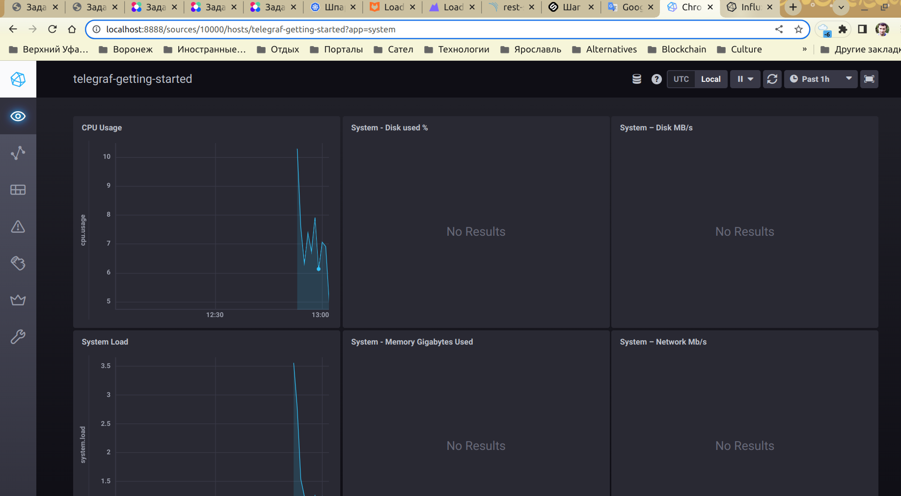

# Домашнее задание к занятию "10.02. Системы мониторинга"

## Обязательные задания

1. Опишите основные плюсы и минусы pull и push систем мониторинга.

push:
- подразумевает отправку данных с агентов, установленных на контролируемых хостах, поэтому на каждом клиенте можно более тонко настроить набор собираемых метрик и параметры отправки, что особенно важно при сильно кастомизированных хостах для мониторинга
- как правило, используется протокол UDP, который имеет меньше накладных расходов
- при работе с большим кол-вом динамически создаваемых и уничтожаемых хостов (например, в облачной среде) очень трудоемко для каждого хоста настраивать мониторинг на стороне сервера, а вот развернуть агенты с готовыми настройками подключения к серверу мониторинга сразу при помощи автоматических и полуавтоматических средств (ansible, terraform и т.п.) вполне возможно и удобно
- с другой стороны, udp протокол не гарантирует доставку и сам по себе не защищен, поэтому возможны утечки данных по сети и потери мониторинговой информации

pull:
- более безопасен, так как исключается появление фишинговых агентов и подмены информации мониторинга, потому что сервер опрашивает только известные ему хосты для мониторинга
- можно использовать более защищенные протоколы для опроса хостов
- недостаток - требуются дополнительные средства для обнаружения новых хостов для мониторинга что усложняет работу в динамически формируемой среде, однако это в принципе решаемо с помощью оркестраторов с discovery и proxy серверами

2. Какие из ниже перечисленных систем относятся к push модели, а какие к pull? А может есть гибридные?

    - Prometheus - pull сам по себе, но может получать push от экспортеров, можно считать его условно гибридным при наличии вспомогательных экспортеров
    - TICK - push
    - Zabbix - из коробки гибридный собственными средствами
    - VictoriaMetrics - по умолчанию включен режим push, но может работать и в режиме pull, если включить его в конфиге флагом --metrics-mode
    - Nagios - насколько я понял, агенты nagios только собирают данные на хостах или отдельных компонентах мониторинга, и затем эти данные собираются при помощи pull, возможность push достигается при помощи доп. средств third-party разработчиков, которые можно сочетать с собственными агентами nagios

3. Склонируйте себе [репозиторий](https://github.com/influxdata/sandbox/tree/master) и запустите TICK-стэк, 
используя технологии docker и docker-compose.(по инструкции ./sandbox up )

В виде решения на это упражнение приведите выводы команд с вашего компьютера (виртуальной машины):

    - curl http://localhost:8086/ping
    - curl http://localhost:8888
    - curl http://localhost:9092/kapacitor/v1/ping


А также скриншот веб-интерфейса ПО chronograf (`http://localhost:8888`). 



P.S.: если при запуске некоторые контейнеры будут падать с ошибкой - проставьте им режим `Z`, например
`./data:/var/lib:Z`


4. Изучите список [telegraf inputs](https://github.com/influxdata/telegraf/tree/master/plugins/inputs).
    - Добавьте в конфигурацию telegraf плагин - [disk](https://github.com/influxdata/telegraf/tree/master/plugins/inputs/disk):
    ```
    [[inputs.disk]]
      ignore_fs = ["tmpfs", "devtmpfs", "devfs", "iso9660", "overlay", "aufs", "squashfs"]
    ```
    - Так же добавьте в конфигурацию telegraf плагин - [mem](https://github.com/influxdata/telegraf/tree/master/plugins/inputs/mem):
    ```
    [[inputs.mem]]
    ```
    - После настройки перезапустите telegraf.
 
    - Перейдите в веб-интерфейс Chronograf (`http://localhost:8888`) и откройте вкладку `Data explorer`.
    - Нажмите на кнопку `Add a query`
    - Изучите вывод интерфейса и выберите БД `telegraf.autogen`
    - В `measurments` выберите mem->host->telegraf_container_id , а в `fields` выберите used_percent. 
    Внизу появится график утилизации оперативной памяти в контейнере telegraf.
    - Вверху вы можете увидеть запрос, аналогичный SQL-синтаксису. 
    Поэкспериментируйте с запросом, попробуйте изменить группировку и интервал наблюдений.
    - Приведите скриншот с отображением
    метрик утилизации места на диске (disk->host->telegraf_container_id) из веб-интерфейса.  

Теперь вкладка называется "Explore" (вероятно, было обновление)


5. Добавьте в конфигурацию telegraf следующий плагин - [docker](https://github.com/influxdata/telegraf/tree/master/plugins/inputs/docker):
```
[[inputs.docker]]
  endpoint = "unix:///var/run/docker.sock"
```

Дополнительно вам может потребоваться донастройка контейнера telegraf в `docker-compose.yml` дополнительного volume и 
режима privileged:
```
  telegraf:
    image: telegraf:1.4.0
    privileged: true
    volumes:
      - ./etc/telegraf.conf:/etc/telegraf/telegraf.conf:Z
      - /var/run/docker.sock:/var/run/docker.sock:Z
    links:
      - influxdb
    ports:
      - "8092:8092/udp"
      - "8094:8094"
      - "8125:8125/udp"
```

После настройки перезапустите telegraf, обновите веб интерфейс и приведите скриншотом список `measurments` в 
веб-интерфейсе базы telegraf.autogen . Там должны появиться метрики, связанные с docker.

Здесь несмотря на все указанные манипуляции, никаких метрик docker в интерфейсе не появилось вообще. Плагин в конфиге уже был установлен, я пробовал только удалять лишние параметры


Здесь тоже пробовал все настройки:


Однако, метрик docker вообще не появилось:


Вариантов настройки работоспособных не нашел, в консоли ошибок нет.

Факультативно можете изучить какие метрики собирает telegraf после выполнения данного задания.


