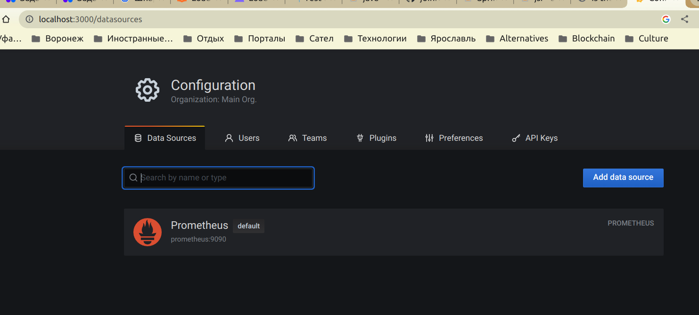
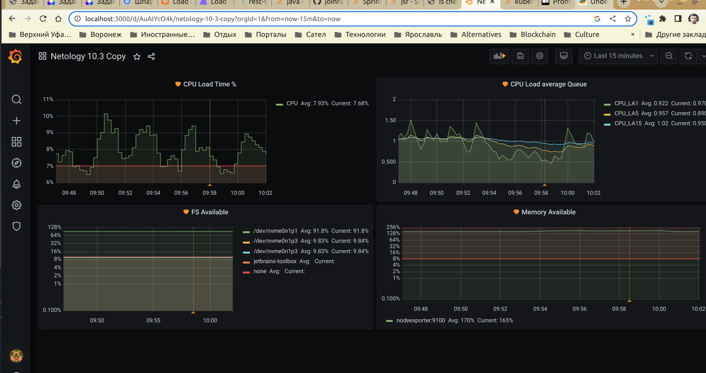

# Домашнее задание к занятию "10.03. Grafana"

## Обязательные задания

### Задание 1
Используя директорию [help](./help) внутри данного домашнего задания - запустите связку prometheus-grafana.

Зайдите в веб-интерфейс графана, используя авторизационные данные, указанные в манифесте docker-compose.

Подключите поднятый вами prometheus как источник данных.

Решение домашнего задания - скриншот веб-интерфейса grafana со списком подключенных Datasource.

Примечание: если не планируется открывать Prometheus для внешней сети (например, локальной, с адресом localhost), то достаточно указать имя сервера prometheus внутри сети docker. Если нужно открыть - следует дополнительно пробросить порты 9090:9090 во вне, что не сделано по умолчанию в файле docker-compose.yml

## Задание 2
Изучите самостоятельно ресурсы:
- [PromQL query to find CPU and memory](https://stackoverflow.com/questions/62770744/promql-query-to-find-cpu-and-memory-used-for-the-last-week)
- [PromQL tutorial](https://valyala.medium.com/promql-tutorial-for-beginners-9ab455142085)
- [Understanding Prometheus CPU metrics](https://www.robustperception.io/understanding-machine-cpu-usage)

Создайте Dashboard и в ней создайте следующие Panels:
- Утилизация CPU для nodeexporter (в процентах, 100-idle)

`100 - (avg by (instance) (rate(node_cpu_seconds_total{job="nodeexporter",mode="idle"}[1m])) * 100)`

- CPULA 1/5/15

`node_load1`

`node_load5`

`node_load15`

- Количество свободной оперативной памяти

`node_memory_Inactive_bytes/node_memory_MemAvailable_bytes*100`

- Количество места на файловой системе

`node_filesystem_avail_bytes{fstype!~"tmpfs|fuse.lxcfs|squashfs"} / node_filesystem_size_bytes{fstype!~"tmpfs|fuse.lxcfs|squashfs"}*100`

Для решения данного ДЗ приведите promql запросы для выдачи этих метрик, а также скриншот получившейся Dashboard.

(скрин уже с алертами, я забыл заскринить то же самое до создания секций alert в каждой секции panel, но внешний вид практически не отличается там и там, различие только в наличии красных линий на графиках для алертов)

## Задание 3
Создайте для каждой Dashboard подходящее правило alert (можно обратиться к первой лекции в блоке "Мониторинг").

Для решения ДЗ - приведите скриншот вашей итоговой Dashboard.

## Задание 4
Сохраните ваш Dashboard.

Для этого перейдите в настройки Dashboard, выберите в боковом меню "JSON MODEL".

Далее скопируйте отображаемое json-содержимое в отдельный файл и сохраните его.

В решении задания - приведите листинг этого файла.

[promsql.json](promql.json)

