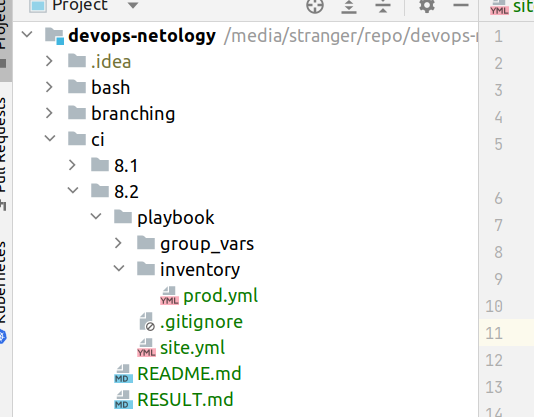
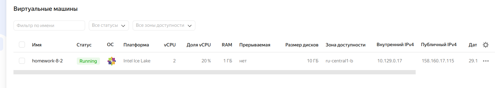
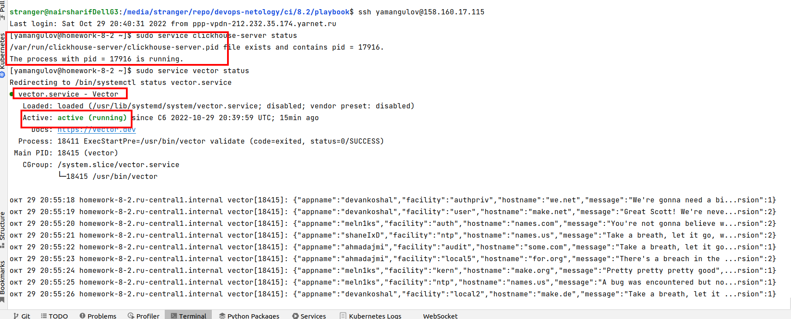

# Домашнее задание к занятию "08.02 Работа с Playbook"

## Подготовка к выполнению

1. (Необязательно) Изучите, что такое [clickhouse](https://www.youtube.com/watch?v=fjTNS2zkeBs) и [vector](https://www.youtube.com/watch?v=CgEhyffisLY)
2. Создайте свой собственный (или используйте старый) публичный репозиторий на github с произвольным именем.
3. Скачайте [playbook](./playbook/) из репозитория с домашним заданием и перенесите его в свой репозиторий.
4. Подготовьте хосты в соответствии с группами из предподготовленного playbook.

Выполнено:

## Основная часть

1. Приготовьте свой собственный inventory файл `prod.yml`.
2. Допишите playbook: нужно сделать ещё один play, который устанавливает и настраивает [vector](https://vector.dev).
3. При создании tasks рекомендую использовать модули: `get_url`, `template`, `unarchive`, `file`.
4. Tasks должны: скачать нужной версии дистрибутив, выполнить распаковку в выбранную директорию, установить vector.
5. Запустите `ansible-lint site.yml` и исправьте ошибки, если они есть.
6. Попробуйте запустить playbook на этом окружении с флагом `--check`.
7. Запустите playbook на `prod.yml` окружении с флагом `--diff`. Убедитесь, что изменения на системе произведены.
8. Повторно запустите playbook с флагом `--diff` и убедитесь, что playbook идемпотентен.
9. Подготовьте README.md файл по своему playbook. В нём должно быть описано: что делает playbook, какие у него есть параметры и теги.
10. Готовый playbook выложите в свой репозиторий, поставьте тег `08-ansible-02-playbook` на фиксирующий коммит, в ответ предоставьте ссылку на него.

Выполнено:
playbook успешно отработал, в консоли вижу, что сервисы установлены и запущены.

playbook имеет разделы tasks и post_tasks, которые я сделал, чтобы разделить выполнение handler одного - после установки БД, а второго - после установки vector. Я использовал параметры для версий clickhouse и vector, описанные в [vars](playbook/group_vars/clickhouse/vars.yml) , теги не использовал. playbook последовательно выкачивает пакеты для clickhouse, устанавливает их и стартует БД, затем выкачивается пакет для vector и также запускается.

