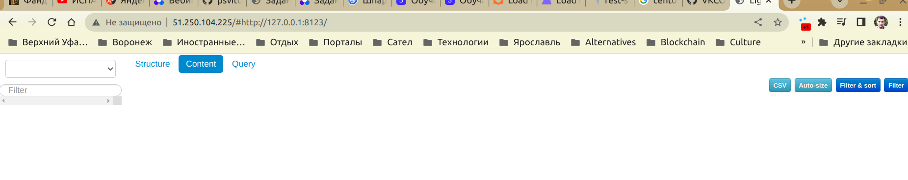

# Домашнее задание к занятию "08.03 Использование Yandex Cloud"

## Подготовка к выполнению

1. (Необязательно) Познакомтесь с [lighthouse](https://youtu.be/ymlrNlaHzIY?t=929)
2. Подготовьте в Yandex Cloud три хоста: для `clickhouse`, для `vector` и для `lighthouse`.

Ссылка на репозиторий LightHouse: https://github.com/VKCOM/lighthouse

Выполнено:

Так как в задании 8.2 я ограничился установкой clickhouse и vector на один хост, теперь пришлось немного переделать playbook для нового задания - сделать три хоста и разнести таски на них по отдельности.

## Основная часть

1. Допишите playbook: нужно сделать ещё один play, который устанавливает и настраивает lighthouse.
2. При создании tasks рекомендую использовать модули: `get_url`, `template`, `yum`, `apt`.
3. Tasks должны: скачать статику lighthouse, установить nginx или любой другой webserver, настроить его конфиг для открытия lighthouse, запустить webserver.
4. Приготовьте свой собственный inventory файл `prod.yml`.
5. Запустите `ansible-lint site.yml` и исправьте ошибки, если они есть.
6. Попробуйте запустить playbook на этом окружении с флагом `--check`.
7. Запустите playbook на `prod.yml` окружении с флагом `--diff`. Убедитесь, что изменения на системе произведены.
8. Повторно запустите playbook с флагом `--diff` и убедитесь, что playbook идемпотентен.
9. Подготовьте README.md файл по своему playbook. В нём должно быть описано: что делает playbook, какие у него есть параметры и теги.
10. Готовый playbook выложите в свой репозиторий, поставьте тег `08-ansible-03-yandex` на фиксирующий коммит, в ответ предоставьте ссылку на него.

Выполнено:

Все серверы установлены, но не настроена связка серверов для работы друг с другом, так как это и не требовалось в текущей задаче
