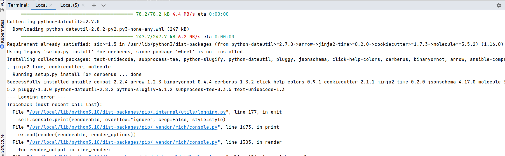
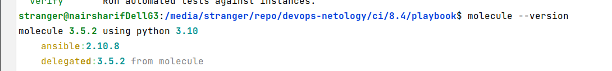
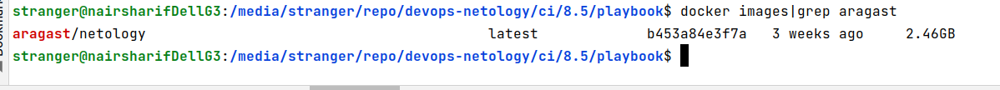
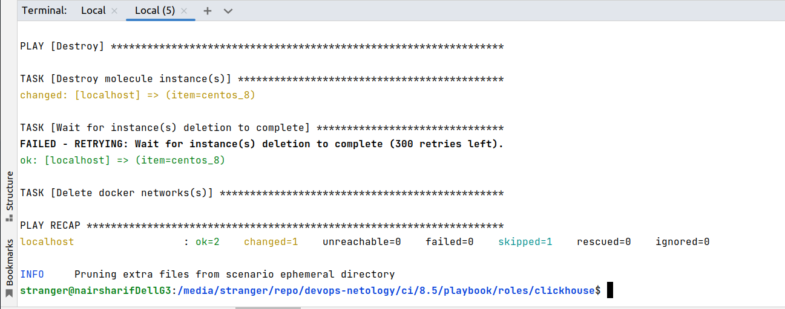
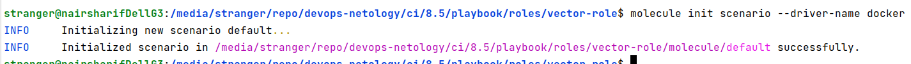
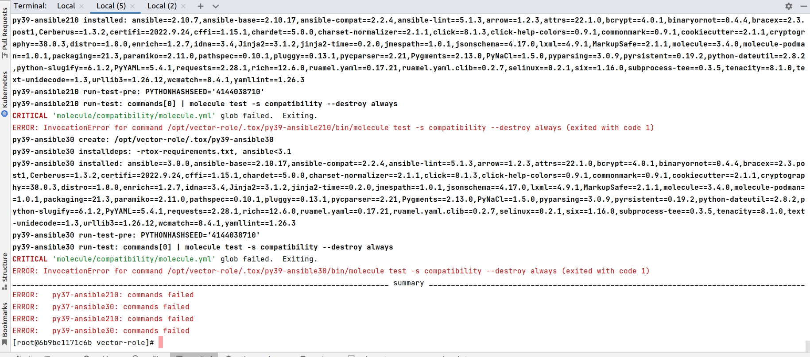
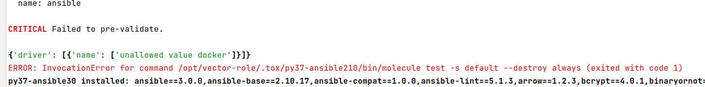
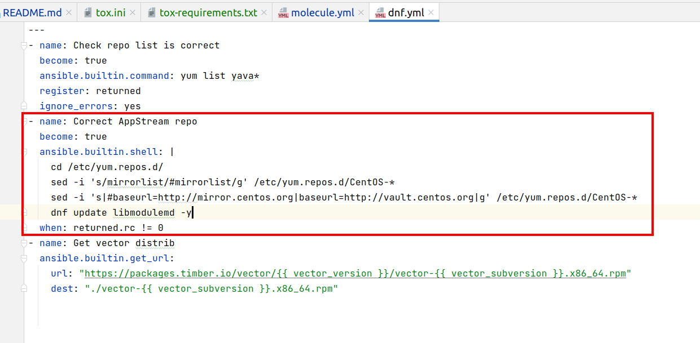

# Домашнее задание к занятию "08.05 Тестирование Roles"

## Подготовка к выполнению
1. Установите molecule: `pip3 install "molecule==3.5.2"`
2. Выполните `docker pull aragast/netology:latest` -  это образ с podman, tox и несколькими пайтонами (3.7 и 3.9) внутри

Выполнено с небольшой ошибкой. Насколько я понял, ошибка связана с изменениями в логировании и не повлияет на работу molecule (возможно, потому что у меня локально стоит python 3.10). molecule все равно успешно запускается

## Основная часть

Наша основная цель - настроить тестирование наших ролей. Задача: сделать сценарии тестирования для vector. Ожидаемый результат: все сценарии успешно проходят тестирование ролей.

### Molecule

1. Запустите  `molecule test -s centos8` внутри корневой директории clickhouse-role, посмотрите на вывод команды.

Успешно прокатил тестирование. Потребовалось только доустановить драйвер docker командой `pip3 install 'molecule[docker]'`

2. Перейдите в каталог с ролью vector-role и создайте сценарий тестирования по умолчанию при помощи `molecule init scenario --driver-name docker`.

3. Добавьте несколько разных дистрибутивов (centos:8, ubuntu:latest) для инстансов и протестируйте роль, исправьте найденные ошибки, если они есть.
4. Добавьте несколько assert'ов в verify.yml файл для  проверки работоспособности vector-role (проверка, что конфиг валидный, проверка успешности запуска, etc). Запустите тестирование роли повторно и проверьте, что оно прошло успешно.
5. Добавьте новый тег на коммит с рабочим сценарием в соответствии с семантическим версионированием.

Выполнено, см. сценарий [default](playbook/roles/vector-role/molecule/default)

### Tox

1. Добавьте в директорию с vector-role файлы из [директории](./example)
2. Запустите `docker run --privileged=True -v <path_to_repo>:/opt/vector-role -w /opt/vector-role -it aragast/netology:latest /bin/bash`, где path_to_repo - путь до корня репозитория с vector-role на вашей файловой системе.
3. Внутри контейнера выполните команду `tox`, посмотрите на вывод.

Вывод: ни на одном из данных окружений сценарий default работать не будет, причина - не правильно указано имя сценария compatibility вместо default. Но этого недостаточно, так как после исправления сценария все равно будет ошибка, указывающая на недопустимый драйвер docker:

5. Создайте облегчённый сценарий для `molecule` с драйвером `molecule_podman`. Проверьте его на исполнимость.
6. Пропишите правильную команду в `tox.ini` для того чтобы запускался облегчённый сценарий.
8. Запустите команду `tox`. Убедитесь, что всё отработало успешно.
9. Добавьте новый тег на коммит с рабочим сценарием в соответствии с семантическим версионированием.

Выполнено: сценарии прокатились на tox с учетом тех исправлений, которые я описал выше. Во всех вариантах конфигурации ubuntu_latest не отработали из-за ошибок.

Но есть одно небольшое замечание по centos_8 - роль для него в принципе не пройдет проверку на идемпотентность, ее невозможно "в лоб" получить на образе docker.io/pycontribs/centos:8, который я использовал в следствие несовершенства самого образа, в нем не удачно настроены репозитории и устарела одна из библиотек, которая выдает ошибки. Если не обращать внимание на формальную неидемпотентность, внесенное мной исправление решает эту проблему при повторных перезапусках роли:

Если бы потребовалось формально добиться идемпотентности при каждом запуске, я бы вынес эти поправки в Dockerfile, создаваемый из того же образа, и затем cetnos_8 тестировал бы на этом новом образе. Но фактически задача все равно решена, и сценарий все равно отрабатывает правильно несмотря на формальную неидемпотентность.

