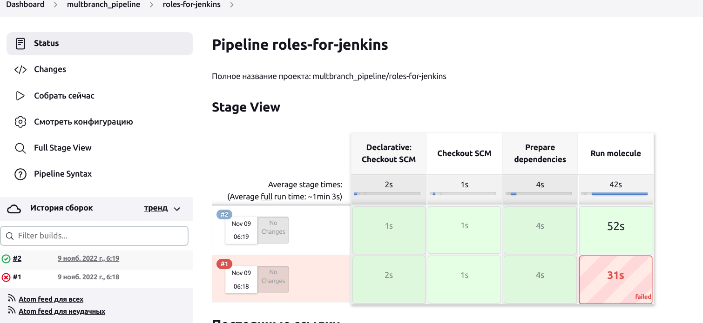

# Домашнее задание к занятию "09.04 Jenkins"

## Подготовка к выполнению

1. Создать 2 VM: для jenkins-master и jenkins-agent.
2. Установить jenkins при помощи playbook'a.
3. Запустить и проверить работоспособность.
4. Сделать первоначальную настройку.

Выполнено:


## Основная часть

1. Сделать Freestyle Job, который будет запускать `molecule test` из любого вашего репозитория с ролью.

Выполнено


Примечание: изначально в репозитории у меня в пайплайне были centos 8 и ubuntu latest, и оба они не заработали на данной установке jenkins, где и сервер и агент установлены на centos 7. Все проблемы - в совместимостях версий библиотек. Например, мне пришлось добавить в шаг такие команды, чтобы убрать конфликты хотя бы для пайплайна на том же centos 7:

```cd ci/8.5/playbook/roles/vector-role
pip3 install --upgrade requests==2.23.0
ansible-galaxy collection install community.docker
pip3 install molecule molecule-docker
molecule test
```
Для centos 8 и ubuntu вообще не удалось ничего сделать, полагаю, надо собирать отдельные стенды на других дистрибутивах хостов, чтобы избежать конфликта библиотек. jenkins производит впечателение очень сырого продукта, пляски с бубном в нем занимают непростительно много времени и мешают выполнению действительно рабочих задач.

2. Сделать Declarative Pipeline Job, который будет запускать `molecule test` из любого вашего репозитория с ролью.

Скрипт пайплайна:
```yaml
pipeline {
    agent {
        label 'linux'
    }

    stages {
        stage('Checkout SCM') {
            steps {
                git branch: 'roles-for-jenkins', credentialsId: '8c017d3f-65ac-46fe-bffc-783e39f26300', url: 'git@github.com:yamangulov/devops-netology.git'
            }
        }
        stage('Prepare dependencies') {
            steps {
                sh '''pip3 install --upgrade requests==2.23.0
                ansible-galaxy collection install community.docker
                pip3 install molecule molecule-docker'''
            }
        }
        stage('Run molecule') {
            steps {
                sh '''cd ci/8.5/playbook/roles/vector-role
                molecule -v test'''
            }
        }
    }
}

```

Результат:


Интересное замечение: если есть два stage типа sh, то команда cd в первом не подействует на второй stage (он опять начнется с корневой директории)

3. Перенести Declarative Pipeline в репозиторий в файл `Jenkinsfile`.

[Jenkinsfile in repo](https://github.com/yamangulov/devops-netology/blob/roles-for-jenkins/ci/8.5/playbook/roles/vector-role/Jenkinsfile)

4. Создать Multibranch Pipeline на запуск `Jenkinsfile` из репозитория.

Выполнено:





Особо нужно обратить внимание на следующее наблюдение: первые ошибке при выполнении пайплайнов вызваны тем, что я попробовал запустить их на обеих ветках одновременно, таким образом, они как-то мешают друг другу. При запуске строго по очереди ошибок не возникает. Еще раз убедился, что jenkins - продукт сырой.

5. Создать Scripted Pipeline, наполнить его скриптом из [pipeline](./pipeline).

Выполнено, пайплайн создается и успешно запускается, но в нем вылетает ошибка 


проверил, что это связано с параметром `secret_check=true`, который на самом деле нам не нужен, поскольку мы не пользуемся авторизацией по паролю.

6. Внести необходимые изменения, чтобы Pipeline запускал `ansible-playbook` без флагов `--check --diff`, если не установлен параметр при запуске джобы (prod_run = True), по умолчанию параметр имеет значение False и запускает прогон с флагами `--check --diff`.
7. Проверить работоспособность, исправить ошибки, исправленный Pipeline вложить в репозиторий в файл `ScriptedJenkinsfile`.

Выполнено


[ScriptedJenkinsfile](pipeline/ScriptedJenkinsfile)

Особенно обратим внимание, что в данном конкретном пайплайне параметр secret_check обязательно должен быть создан, поэтому пайплайн не отработает без блока else, где задается его альтернативное значение, вылетит ошибка. 

8. Отправить ссылку на репозиторий с ролью и Declarative Pipeline и Scripted Pipeline.


