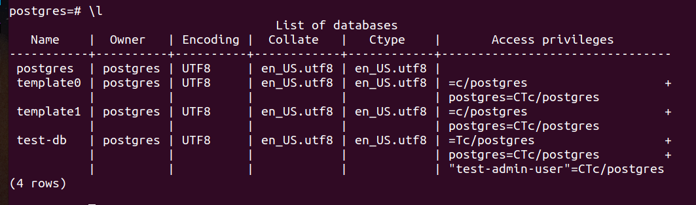
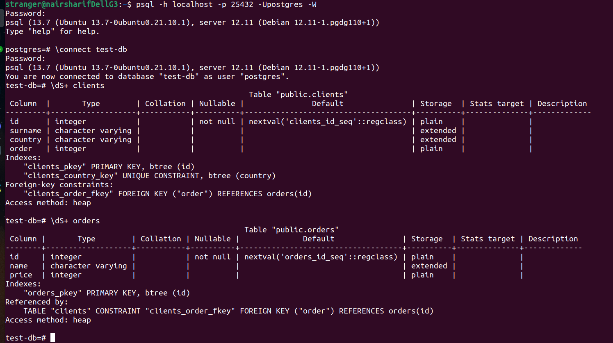
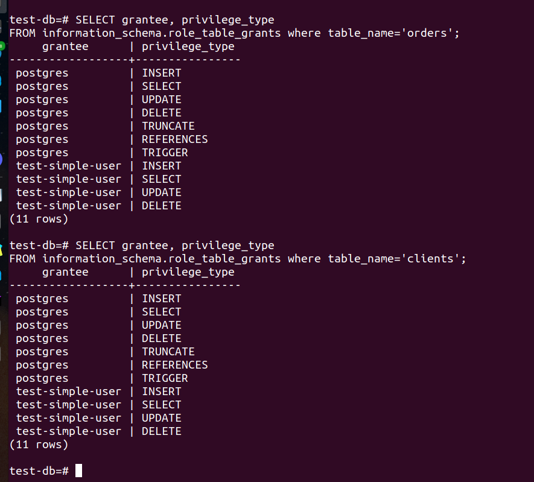
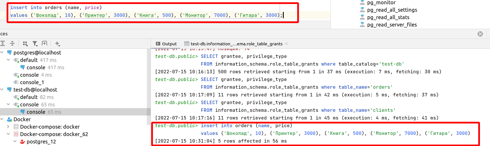
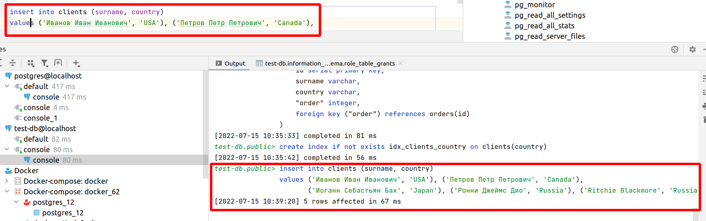
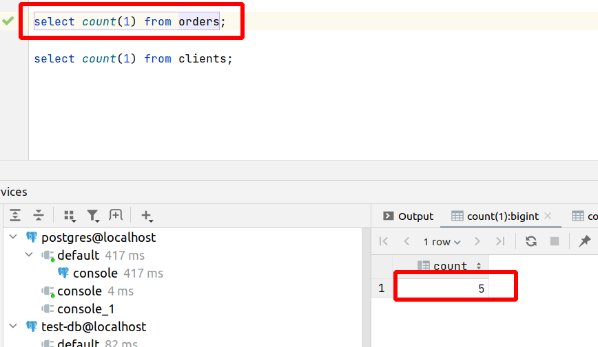
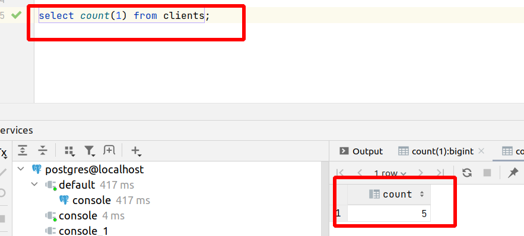
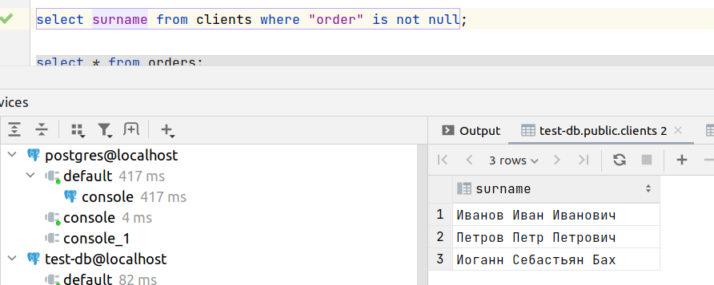
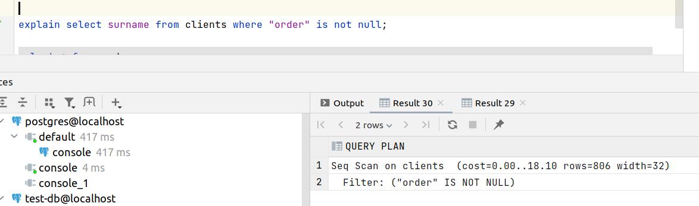

## Задача 1

Используя docker поднимите инстанс PostgreSQL (версию 12) c 2 volume, 
в который будут складываться данные БД и бэкапы.

Выполнено: [docker-compose.yml](docker_6.2/docker-compose.yml)

## Задача 2

В БД из задачи 1: 
- создайте пользователя test-admin-user и БД test_db
```postgresql
create user "test-admin-user" with password '123456';
create database "test-db";
```

- в БД test_db создайте таблицу orders и clients (спeцификация таблиц ниже)
```postgresql
create table orders (
    id serial primary key,
    name varchar,
    price integer
);

create table clients (
    id serial primary key,
    surname varchar,
    country varchar,
    "order" integer,
    foreign key ("order") references orders(id)
);
create index if not exists idx_clients_country on clients(country);
```
Но следует учесть, что нужно обязательно переключится в БД test-db, так как cross-database references are not implemented. В консоли можно это сделать командой `\connect test-db`, либо создать новый datasource в intellij idea и переключиться в него, а затем открыть новую консоль

- предоставьте привилегии на все операции пользователю test-admin-user на таблицы БД test_db
```postgresql
grant all privileges on database "test-db" to "test-admin-user";
```

- создайте пользователя test-simple-user  

```postgresql
create user "test-simple-user" with password '123';
```

- предоставьте пользователю test-simple-user права на SELECT/INSERT/UPDATE/DELETE данных таблиц БД test_db

```postgresql
grant select, update, insert, delete on orders, clients to "test-simple-user";
```
этот запрос тоже нужно выполнить, подключившись к БД test-db

Таблица orders:
- id (serial primary key)
- наименование (string)
- цена (integer)

Таблица clients:
- id (serial primary key)
- фамилия (string)
- страна проживания (string, index)
- заказ (foreign key orders)

Приведите:
- итоговый список БД после выполнения пунктов выше,
- описание таблиц (describe)
- SQL-запрос для выдачи списка пользователей с правами над таблицами test_db
- список пользователей с правами над таблицами test_db



---



---



---
## Задача 3

Используя SQL синтаксис - наполните таблицы следующими тестовыми данными:

Таблица orders

|Наименование|цена|
|------------|----|
|Шоколад| 10 |
|Принтер| 3000 |
|Книга| 500 |
|Монитор| 7000|
|Гитара| 4000|

Таблица clients

|ФИО|Страна проживания|
|------------|----|
|Иванов Иван Иванович| USA |
|Петров Петр Петрович| Canada |
|Иоганн Себастьян Бах| Japan |
|Ронни Джеймс Дио| Russia|
|Ritchie Blackmore| Russia|

Используя SQL синтаксис:
- вычислите количество записей для каждой таблицы 
- приведите в ответе:
    - запросы 
    - результаты их выполнения.



---



---



---




## Задача 4

Часть пользователей из таблицы clients решили оформить заказы из таблицы orders.

Используя foreign keys свяжите записи из таблиц, согласно таблице:

|ФИО|Заказ|
|------------|----|
|Иванов Иван Иванович| Книга |
|Петров Петр Петрович| Монитор |
|Иоганн Себастьян Бах| Гитара |

Приведите SQL-запросы для выполнения данных операций.

```postgresql
update clients set "order"=(select id from orders where name='Книга') where surname='Иванов Иван Иванович';
update clients set "order"=(select id from orders where name='Монитор') where surname='Петров Петр Петрович';
update clients set "order"=(select id from orders where name='Гитара') where surname='Иоганн Себастьян Бах';
```

Приведите SQL-запрос для выдачи всех пользователей, которые совершили заказ, а также вывод данного запроса.


 


## Задача 5

Получите полную информацию по выполнению запроса выдачи всех пользователей из задачи 4 
(используя директиву EXPLAIN).

Приведите получившийся результат и объясните что значат полученные значения.



Seq Scan означает, что было выполнено полное построчное сканирование всей БД clients

## Задача 6

Создайте бэкап БД test_db и поместите его в volume, предназначенный для бэкапов (см. Задачу 1).

```postgresql
pg_dump -h localhost -p 25432 -Upostgres -f src/main/resources/data/backups/test-db.bkp -d test-db

```

Остановите контейнер с PostgreSQL (но не удаляйте volumes).

Поднимите новый пустой контейнер с PostgreSQL.

Восстановите БД test_db в новом контейнере.

```postgresql
psql -h localhost -p 45432 -Upostgres -d new-test-db -f src/main/resources/data/backups/test-db.bkp
```

