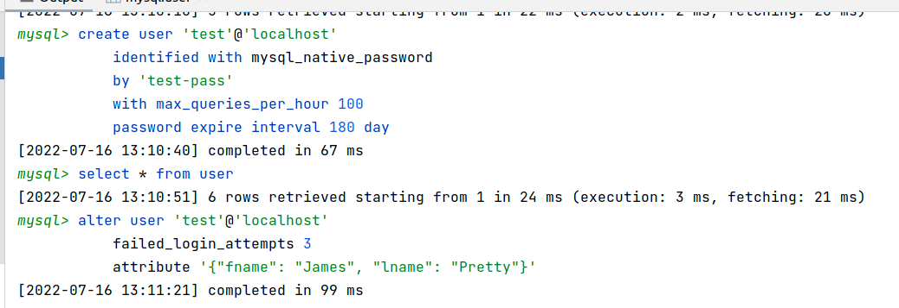

# Домашнее задание к занятию "6.3. MySQL"

## Задача 1

Используя docker поднимите инстанс MySQL (версию 8). Данные БД сохраните в volume.

Выполнено: [docker-compose.yaml](docker_6.3/docker-compose.yml)

дополнительное замечания - в файл добавлена опция, чтобы сразу создавалась БД, куда мы будем импортировать таблицы из бэкапа, так как в бэкапе не задано отдельной команды для создания БД, только для таблиц

Изучите [бэкап БД](test_data/test_dump.sql) и 
восстановитесь из него.

Выполнено:


---


Перейдите в управляющую консоль `mysql` внутри контейнера.


Используя команду `\h` получите список управляющих команд.

Найдите команду для выдачи статуса БД и **приведите в ответе** из ее вывода версию сервера БД.


Подключитесь к восстановленной БД и получите список таблиц из этой БД.


**Приведите в ответе** количество записей с `price` > 300.


## Задача 2

Создайте пользователя test в БД c паролем test-pass, используя:
- плагин авторизации mysql_native_password
- срок истечения пароля - 180 дней 
- количество попыток авторизации - 3 
- максимальное количество запросов в час - 100
- аттрибуты пользователя:
    - Фамилия "Pretty"
    - Имя "James"

Результат: создать пользователя с полным набором требуемых данных в одном запросе не получается, хотя документация и утверждает обратное, но запрос такого вида:
```mysql
create user 'test'@'localhost'
    identified with mysql_native_password
    by 'test-pass'
    with max_queries_per_hour 100
    password expire interval 180 day
    failed_login_attempts 3
    attribute '{"fname": "James", "lname": "Pretty"}';
```
завершается с ошибкой `[42000][1064] You have an error in your SQL syntax`. Поэтому я обошел эту проблему и решил задачу двумя запросами:
```mysql
create user 'test'@'localhost'
    identified with mysql_native_password
    by 'test-pass'
    with max_queries_per_hour 100
    password expire interval 180 day;

alter user 'test'@'localhost'
    failed_login_attempts 3
    attribute '{"fname": "James", "lname": "Pretty"}';
```
И хотя консоль поругалась на строку `failed_login_attempts 3`, но запрос выполнился успешно:



Предоставьте привелегии пользователю `test` на операции SELECT базы `test_db`.

```mysql
grant select on test_db.* to 'test'@'localhost';
```
    
Используя таблицу INFORMATION_SCHEMA.USER_ATTRIBUTES получите данные по пользователю `test` и 
**приведите в ответе к задаче**.


## Задача 3

Установите профилирование `SET profiling = 1`.
Изучите вывод профилирования команд `SHOW PROFILES;`.


Команда используется для просмотра профилирования выполняемых запросов, поэтому она показывает результат после выполнения какого-то запроса.

Исследуйте, какой `engine` используется в таблице БД `test_db` и **приведите в ответе**.


Измените `engine` и **приведите время выполнения и запрос на изменения из профайлера в ответе**:
- на `MyISAM`
- на `InnoDB`

Результат:
по умолчанию для заказов уже стоит InnoDB. Выполняем запрос на обновление и смотрим профили командой `show profiles;`


---

Меняем движок для таблицы:


---

Еще раз выполняем запрос, чтобы профилировщик отработал с новым движком:


---

Снова смотрим профили:


в результате запрос у меня прошел почти втрое быстрее, это, конечно, противоречит общепринятой информации, что при вставке MyISAM работает медленне. Но если почитать источники, то становится понятно, что в my.cnf закомментирована опция general_log = 1 по умолчанию, именно поэтому пока что MyISAM быстрее на запись - нет затрат на журналирование, а вот если включить запись журнала, то все будет именно так, например, можно это сделать в my.cnf или командой `SET GLOBAL general_log = 'ON';`

## Задача 4 

Изучите файл `my.cnf` в директории /etc/mysql.

Измените его согласно ТЗ (движок InnoDB):
- Скорость IO важнее сохранности данных
- Нужна компрессия таблиц для экономии места на диске
- Размер буффера с незакомиченными транзакциями 1 Мб
- Буффер кеширования 30% от ОЗУ
- Размер файла логов операций 100 Мб

Приведите в ответе измененный файл `my.cnf`.

Файл [my.cnf](my.cnf)


