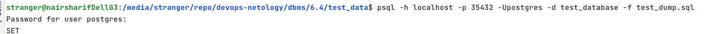
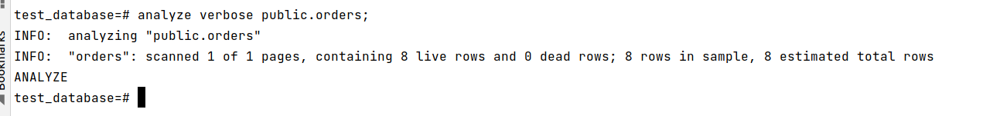
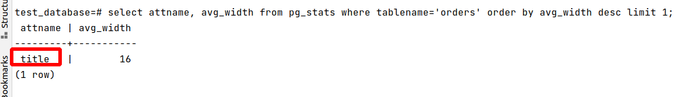
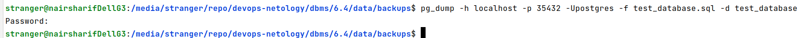

# Домашнее задание к занятию "6.4. PostgreSQL"

## Задача 1

Используя docker поднимите инстанс PostgreSQL (версию 13). Данные БД сохраните в volume.

Выполнено: [docker-compose.yml](docker_6.4/docker-compose.yml)

Подключитесь к БД PostgreSQL используя `psql`.

Воспользуйтесь командой `\?` для вывода подсказки по имеющимся в `psql` управляющим командам.

**Найдите и приведите** управляющие команды для:
- вывода списка БД `\l`
- подключения к БД `\connect db_name`
- вывода списка таблиц `\dt`
- вывода описания содержимого таблиц `\dS+ table_name`
- выхода из psql `\q`

## Задача 2

Используя `psql` создайте БД `test_database`.

```postgresql
create database test_database;
```

Изучите [бэкап БД](https://github.com/netology-code/virt-homeworks/tree/master/06-db-04-postgresql/test_data).

Восстановите бэкап БД в `test_database`.

Возвращаемся в shell и выполняем следующую команду:



Перейдите в управляющую консоль `psql` внутри контейнера.

Подключитесь к восстановленной БД и проведите операцию ANALYZE для сбора статистики по таблице.



Используя таблицу [pg_stats](https://postgrespro.ru/docs/postgresql/12/view-pg-stats), найдите столбец таблицы `orders` 
с наибольшим средним значением размера элементов в байтах.

**Приведите в ответе** команду, которую вы использовали для вычисления и полученный результат.



## Задача 3

Архитектор и администратор БД выяснили, что ваша таблица orders разрослась до невиданных размеров и
поиск по ней занимает долгое время. Вам, как успешному выпускнику курсов DevOps в нетологии предложили
провести разбиение таблицы на 2 (шардировать на orders_1 - price>499 и orders_2 - price<=499).

Предложите SQL-транзакцию для проведения данной операции.

Можно ли было изначально исключить "ручное" разбиение при проектировании таблицы orders?

Ответ: в документации мы видим, что преобразовать обычную таблицу в секционированную в этой БД нельзя https://postgrespro.ru/docs/postgresql/13/ddl-partitioning .
Поэтому очевидным является обходное решение - исходную таблицу переименовать, создать новую таблицу с прежним именем, но уже секционированную, затем перенести данные из старой таблицы в новую. Настройку секционирования можно было сделать изначально, при создании таблицы orders на этапе проектирования. Однако, есть ограничение, когда мы делаем partion by range(...список столбцов...) - нас не спрашивают, какие должны быть диапазоны ранжирования. При первоначальном создании таблиц это для нас не критично - пусть СУБД разбивает таблицу автоматически, не важно какие будут выбраны диапазоны, лишь бы шардирование было и работало. Однако, для этой задачи указаны строгие диапазоны, поэтому для ручного разбиения можно вручную разнести данные по двум таблицам с диапазонами, а потом сделать в новой таблице ссылки на них. Например, вот так (пример аналогичного разбиения - https://postgrespro.ru/docs/postgresql/13/ddl-partitioning#DDL-PARTITIONING-DECLARATIVE)


```postgresql
alter table orders rename to orders_old;
create table orders (id integer, title varchar, price integer) partition by range(price);
create table orders_less499 partition of orders for values from (0) to (499);
create table orders_more499 partition of orders for values from (499) to (2147483647);
-- здесь при вставке данные будут перенаправлены во вложенную секцию в соответствии с диапазоном price
insert into orders (id, title, price) select * from orders_old;
```

## Задача 4

Используя утилиту `pg_dump` создайте бекап БД `test_database`.



Как бы вы доработали бэкап-файл, чтобы добавить уникальность значения столбца `title` для таблиц `test_database`?

Ответ: прежде всего, после восстановления таблицы из бекапа не гарантируется, что в ней нет дубликатов по полю 'title'. Поэтому в конце файла бекапа добавим две команды - для удаления дубликатов и после нее - для обеспечения уникальности, например:
```postgresql
delete from orders where ctid not in
(select max(ctid) FROM orders group by title);

alter table orders add constraint unique_title_constraint unique(title)
```
здесь ctid - это уникальный скрытый идентификатор, который существует в каждой таблице postgresql, таким образом, мы удаляем все самые старые дубли по полю title, уже затем добавляем ограничение уникальности на title


