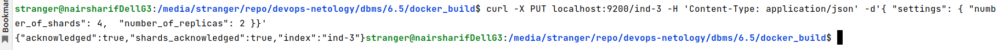
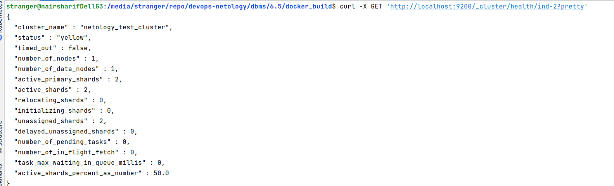
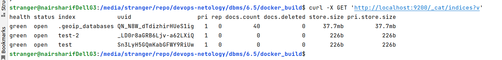

# Домашнее задание к занятию "6.5. Elasticsearch"

## Задача 1

Используя докер образ [elasticsearch:7](https://hub.docker.com/_/elasticsearch) как базовый:

- составьте Dockerfile-манифест для elasticsearch
- соберите docker-образ и сделайте `push` в ваш docker.io репозиторий
- запустите контейнер из получившегося образа и выполните запрос пути `/` c хост-машины

Этот список действий является излишним при использовании образа elasticsearch:7, он был актуален для образа, который ранее собирался из centos:7 (вероятно, эти пункты просто забыли вычистить из задания, как актуальные для старой версии задания). Более того, в образе elasticsearch:7 сервер elasticsearch уже собран и запущен в entrypoint, если в Dockerfile перезаписать elasticsearch.yml и снова перезапустить сервер elasticsearch, это будет очень криво. Ниже описанные требования намного проще выполнить, воспользовавшись дефолтными возможностями официального образа elasticsearch:7 - просто передать нужные параметры в docker или docker-compose через переменные среды, и они фактически перезапишутся при старте контейнера

Требования к `elasticsearch.yml`:
- данные `path` должны сохраняться в `/var/lib` 
- имя ноды должно быть `netology_test`

В ответе приведите:
- текст Dockerfile манифеста
- ссылку на образ в репозитории dockerhub
- ответ `elasticsearch` на запрос пути `/` в json виде

В новых обстоятельствах, когда в РФ мы пользуемся уже готовым docker образом, Dockerfile не нужен, мы ничего не меняем в образе, и нет смысла делать Dockerfile. Поэтому привожу ссылку на [docker-compose.yml](docker_6.5/docker-compose.yml) при запуске которого все требования к path и имени ноды успешно выполняются.

Соответствующий ответ на запрос:

## Задача 2

Ознакомтесь с [документацией](https://www.elastic.co/guide/en/elasticsearch/reference/current/indices-create-index.html) 
и добавьте в `elasticsearch` 3 индекса, в соответствии со таблицей:

| Имя | Количество реплик | Количество шард |
|-----|-------------------|-----------------|
| ind-1| 0 | 1 |
| ind-2 | 1 | 2 |
| ind-3 | 2 | 4 |

(Примечание: так как в задаче не предусмотрена установка и настройка Kibana, то необходимо использовать curl или, например, Postman или любой другой продвинутый http клиент или даже браузер, в Kibana все эти запросы можно было бы выполнить сразу в консоли разработчика)

Получите список индексов и их статусов, используя API и **приведите в ответе** на задание.

Получите состояние кластера `elasticsearch`, используя API.

Как вы думаете, почему часть индексов и кластер находится в состоянии yellow?

Этот вопрос подробно освещался в лекции - наш кластер находится в режиме single-node, у него только одна нода, поэтому сам кластер всегда будет находится в статусе не лучше, чем yellow (неисправность единственной ноды сразу сделает его неработоспособным). Аналогично и для индексов, причина в том же, индексам некуда реплицироваться, и поэтому кластер не может распределить их по шардам (пункт "unassigned shards" в выводе статусов индексов показывает число нераспределенных шард)

Удалите все индексы.

## Задача 3

Создайте директорию `{путь до корневой директории с elasticsearch в образе}/snapshots`.

Выполнил создание директории в консоли:

Используя API [зарегистрируйте](https://www.elastic.co/guide/en/elasticsearch/reference/current/snapshots-register-repository.html#snapshots-register-repository) 
данную директорию как `snapshot repository` c именем `netology_backup`.

Если просто сразу попытаться выполнить создание репозитория в нужную директорию, то мы получим ошибку. Причина очевидно подсказывается самим выводом ошибки:

Чтобы ее исправить, добавим еще один параметр в переменные среды, чтобы он попал в elasticsearch.yml и перезапустим контейнер. После перезапуска изменим в терминале контейнера права на snapshots с root:root на elasticsearch:root:

Альтернативный вариант: создать каталог для снапшотов вручную в контейнере и там же вручную добавить опцию path.repo в файл elasticsearch.yml, но все равно потребуется перезагрузка эластика. Нигде не нашел, как можно было бы перечитать конфигурацию эластика динамически, не перезапуская его, в сильно урезанном контейнере с tini в качестве замены для systemctl. В обычном случае было бы достаточно systemctl stop/start elasticsearch.service. Вообще, мне показалось, что если нужно собрать docker контейнер для продуктива с elasticsearch, то лучше все-таки собирать его из более "толстого" исходного контейнера, например, из ubuntu server, чтобы в нем были все полезные для продуктива утилиты и службы, а эластик поднимать в нем, как-нибудь выкачав его tar архив через vpn или еще как-то, раз его нельзя установить в РФ теперь напрямую.

**Приведите в ответе** запрос API и результат вызова API для создания репозитория.

Создайте индекс `test` с 0 реплик и 1 шардом и **приведите в ответе** список индексов.

[Создайте `snapshot`](https://www.elastic.co/guide/en/elasticsearch/reference/current/snapshots-take-snapshot.html) 
состояния кластера `elasticsearch`.

**Приведите в ответе** список файлов в директории со `snapshot`ами.

Удалите индекс `test` и создайте индекс `test-2`. **Приведите в ответе** список индексов.

[Восстановите](https://www.elastic.co/guide/en/elasticsearch/reference/current/snapshots-restore-snapshot.html) состояние
кластера `elasticsearch` из `snapshot`, созданного ранее. 

**Приведите в ответе** запрос к API восстановления и итоговый список индексов.

При обычных попытках удаления мы получаем ряд ошибок, связанных с тем, что в системе существуют несколько скрытых индексов и системный индекс geoip, которые тоже забекапились нашей командой, например:

И аналогичные ошибки для каждого из имен индексов. Что восстановиться из бекапа в этом случае мне понадобилось закрыть скрытые индексы, а geoip внести в специальный параметр feature_states:

После чего мы видим в списке индексов как созданный новый индекс, так и восстановленный, то есть новые индексы не удаляются при восстановлении старых, это ок:

