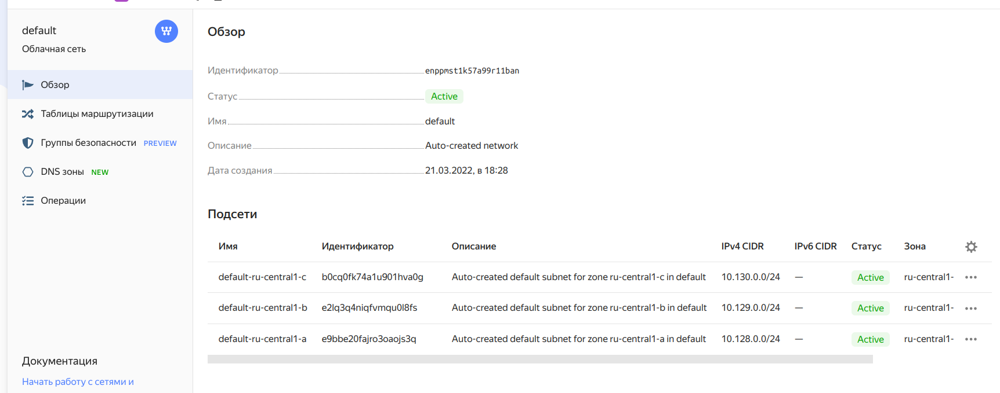
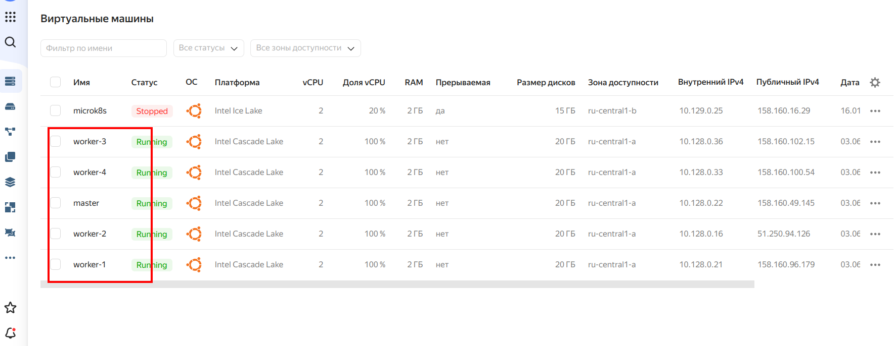
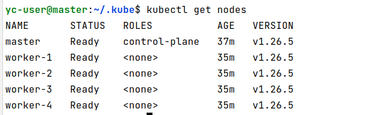

Для установки кластера воспользовался уже ранее настроенными мной для других заданий сетью с подсетями:



Установим виртуальные машины для кластера:

```shell
(venv) stranger@nairsharifDellG3:/media/stranger/repo/devops-netology/kuber-cloud/14.2$ bash ./install-vms.sh 
done (39s)
id: fhme57te7hb0puab3bgv
folder_id: b1g9qk8kfl0vmmdrjtrt
created_at: "2023-06-03T07:54:18Z"
name: master
zone_id: ru-central1-a
platform_id: standard-v2
resources:
  memory: "2147483648"
  cores: "2"
  core_fraction: "100"
status: RUNNING
boot_disk:
  mode: READ_WRITE
  device_name: fhmfgfnrj4sk4k2vffos
  auto_delete: true
  disk_id: fhmfgfnrj4sk4k2vffos
network_interfaces:
- index: "0"
  mac_address: d0:0d:e2:9f:ae:3c
  subnet_id: e9bbe20fajro3oaojs3q
  primary_v4_address:
    address: 10.128.0.22
    one_to_one_nat:
      address: 158.160.49.145
      ip_version: IPV4
fqdn: master.ru-central1.internal
scheduling_policy: {}
network_settings:
  type: STANDARD
placement_policy: {}

done (38s)
id: fhmjn273ub74oc6ql128
folder_id: b1g9qk8kfl0vmmdrjtrt
created_at: "2023-06-03T07:54:58Z"
name: worker-1
zone_id: ru-central1-a
platform_id: standard-v2
resources:
  memory: "2147483648"
  cores: "2"
  core_fraction: "100"
status: RUNNING
boot_disk:
  mode: READ_WRITE
  device_name: fhmf24t6djtev5n22ksh
  auto_delete: true
  disk_id: fhmf24t6djtev5n22ksh
network_interfaces:
- index: "0"
  mac_address: d0:0d:13:b8:8e:3f
  subnet_id: e9bbe20fajro3oaojs3q
  primary_v4_address:
    address: 10.128.0.21
    one_to_one_nat:
      address: 158.160.96.179
      ip_version: IPV4
fqdn: worker-1.ru-central1.internal
scheduling_policy: {}
network_settings:
  type: STANDARD
placement_policy: {}

done (33s)
id: fhmflc8jv8g1a4egu0pt
folder_id: b1g9qk8kfl0vmmdrjtrt
created_at: "2023-06-03T07:55:37Z"
name: worker-2
zone_id: ru-central1-a
platform_id: standard-v2
resources:
  memory: "2147483648"
  cores: "2"
  core_fraction: "100"
status: RUNNING
boot_disk:
  mode: READ_WRITE
  device_name: fhmgggopmvcidrli5ftv
  auto_delete: true
  disk_id: fhmgggopmvcidrli5ftv
network_interfaces:
- index: "0"
  mac_address: d0:0d:fa:b1:13:fa
  subnet_id: e9bbe20fajro3oaojs3q
  primary_v4_address:
    address: 10.128.0.16
    one_to_one_nat:
      address: 51.250.94.126
      ip_version: IPV4
fqdn: worker-2.ru-central1.internal
scheduling_policy: {}
network_settings:
  type: STANDARD
placement_policy: {}

done (33s)
id: fhm5ma53sn4ov20uk1o6
folder_id: b1g9qk8kfl0vmmdrjtrt
created_at: "2023-06-03T07:56:11Z"
name: worker-3
zone_id: ru-central1-a
platform_id: standard-v2
resources:
  memory: "2147483648"
  cores: "2"
  core_fraction: "100"
status: RUNNING
boot_disk:
  mode: READ_WRITE
  device_name: fhmethn99d6871qko3a4
  auto_delete: true
  disk_id: fhmethn99d6871qko3a4
network_interfaces:
- index: "0"
  mac_address: d0:0d:5b:28:a3:e5
  subnet_id: e9bbe20fajro3oaojs3q
  primary_v4_address:
    address: 10.128.0.36
    one_to_one_nat:
      address: 158.160.102.15
      ip_version: IPV4
fqdn: worker-3.ru-central1.internal
scheduling_policy: {}
network_settings:
  type: STANDARD
placement_policy: {}

done (38s)
id: fhm9v7qkrer46496lome
folder_id: b1g9qk8kfl0vmmdrjtrt
created_at: "2023-06-03T07:56:45Z"
name: worker-4
zone_id: ru-central1-a
platform_id: standard-v2
resources:
  memory: "2147483648"
  cores: "2"
  core_fraction: "100"
status: RUNNING
boot_disk:
  mode: READ_WRITE
  device_name: fhm06umlvq4re9ai1f3i
  auto_delete: true
  disk_id: fhm06umlvq4re9ai1f3i
network_interfaces:
- index: "0"
  mac_address: d0:0d:9f:9f:54:db
  subnet_id: e9bbe20fajro3oaojs3q
  primary_v4_address:
    address: 10.128.0.33
    one_to_one_nat:
      address: 158.160.100.54
      ip_version: IPV4
fqdn: worker-4.ru-central1.internal
scheduling_policy: {}
network_settings:
  type: STANDARD
placement_policy: {}

(venv) stranger@nairsharifDellG3:/media/stranger/repo/devops-netology/kuber-cloud/14.2$ 

```



Подключаемся к мастеру и закачиваем kubespray из github:

```shell
yc-user@master:~$ git clone https://github.com/kubernetes-sigs/kubespray
Cloning into 'kubespray'...
remote: Enumerating objects: 68439, done.
remote: Counting objects: 100% (307/307), done.
remote: Compressing objects: 100% (183/183), done.
remote: Total 68439 (delta 120), reused 253 (delta 104), pack-reused 68132
Receiving objects: 100% (68439/68439), 21.63 MiB | 8.44 MiB/s, done.
Resolving deltas: 100% (38560/38560), done.
```

Устанавливаем зависимости:

```shell
yc-user@master:~/kubespray$ pip3 install -r requirements.txt
Collecting ansible==5.7.1
  Downloading ansible-5.7.1.tar.gz (35.7 MB)
     |████████████████████████████████| 35.7 MB 6.9 kB/s 
Collecting ansible-core==2.12.10
  Downloading ansible-core-2.12.10.tar.gz (7.8 MB)
     |████████████████████████████████| 7.8 MB 2.4 kB/s 
Collecting cryptography==3.4.8
  Downloading cryptography-3.4.8-cp36-abi3-manylinux_2_17_x86_64.manylinux2014_x86_64.whl (3.2 MB)
     |████████████████████████████████| 3.2 MB 38 kB/s 
Collecting jinja2==3.1.2
  Downloading Jinja2-3.1.2-py3-none-any.whl (133 kB)
     |████████████████████████████████| 133 kB 55.9 MB/s 
Collecting jmespath==1.0.1
  Downloading jmespath-1.0.1-py3-none-any.whl (20 kB)
Collecting MarkupSafe==2.1.2
  Downloading MarkupSafe-2.1.2-cp38-cp38-manylinux_2_17_x86_64.manylinux2014_x86_64.whl (25 kB)
Collecting netaddr==0.8.0
  Downloading netaddr-0.8.0-py2.py3-none-any.whl (1.9 MB)
     |████████████████████████████████| 1.9 MB 60.1 MB/s 
Collecting pbr==5.11.1
  Downloading pbr-5.11.1-py2.py3-none-any.whl (112 kB)
     |████████████████████████████████| 112 kB 139 bytes/s 
Collecting ruamel.yaml==0.17.21
  Downloading ruamel.yaml-0.17.21-py3-none-any.whl (109 kB)
     |████████████████████████████████| 109 kB 54.2 MB/s 
Collecting ruamel.yaml.clib==0.2.7
  Downloading ruamel.yaml.clib-0.2.7-cp38-cp38-manylinux_2_17_x86_64.manylinux2014_x86_64.manylinux_2_24_x86_64.whl (555 kB)
     |████████████████████████████████| 555 kB 52.6 MB/s 
Requirement already satisfied: PyYAML in /usr/lib/python3/dist-packages (from ansible-core==2.12.10->-r requirements.txt (line 2)) (5.3.1)
Collecting packaging
  Downloading packaging-23.1-py3-none-any.whl (48 kB)
     |████████████████████████████████| 48 kB 4.8 MB/s 
Collecting resolvelib<0.6.0,>=0.5.3
  Downloading resolvelib-0.5.4-py2.py3-none-any.whl (12 kB)
Collecting cffi>=1.12
  Downloading cffi-1.15.1-cp38-cp38-manylinux_2_17_x86_64.manylinux2014_x86_64.whl (442 kB)
     |████████████████████████████████| 442 kB 51.9 MB/s 
Collecting pycparser
  Downloading pycparser-2.21-py2.py3-none-any.whl (118 kB)
     |████████████████████████████████| 118 kB 50.9 MB/s 
Building wheels for collected packages: ansible, ansible-core
  Building wheel for ansible (setup.py) ... done
  Created wheel for ansible: filename=ansible-5.7.1-py3-none-any.whl size=61777681 sha256=d65555eba38573524b0e88539c91448844d3dc4ad1acc3db7ff853e94a5e4414
  Stored in directory: /home/yc-user/.cache/pip/wheels/02/07/2a/7b3eb5d79e268b769b0910cded0d524b4647ae5bc19f3ebb70
  Building wheel for ansible-core (setup.py) ... done
  Created wheel for ansible-core: filename=ansible_core-2.12.10-py3-none-any.whl size=2079008 sha256=d75b58d6fc6577ed30019bf1692c9af9d765b7446111d2972860ac186fcbd37a
  Stored in directory: /home/yc-user/.cache/pip/wheels/eb/61/b4/118d4eac8be0248f90ddde117bee70e10d3a37be86786289a5
Successfully built ansible ansible-core
Installing collected packages: pycparser, cffi, cryptography, MarkupSafe, jinja2, packaging, resolvelib, ansible-core, ansible, jmespath, netaddr, pbr, ruamel.yaml.clib, ruamel.yaml
  WARNING: The script netaddr is installed in '/home/yc-user/.local/bin' which is not on PATH.
  Consider adding this directory to PATH or, if you prefer to suppress this warning, use --no-warn-script-location.
  WARNING: The script pbr is installed in '/home/yc-user/.local/bin' which is not on PATH.
  Consider adding this directory to PATH or, if you prefer to suppress this warning, use --no-warn-script-location.
Successfully installed MarkupSafe-2.1.2 ansible-5.7.1 ansible-core-2.12.10 cffi-1.15.1 cryptography-3.4.8 jinja2-3.1.2 jmespath-1.0.1 netaddr-0.8.0 packaging-23.1 pbr-5.11.1 pycparser-2.21 resolvelib-0.5.4 ruamel.yaml-0.17.21 ruamel.yaml.clib-0.2.7

```

Конфигурируем kubespray для моего кластера:

```shell
yc-user@master:~/kubespray$ CONFIG_FILE=inventory/mycluster/hosts.yaml python3 contrib/inventory_builder/inventory.py ${IPS[@]}
DEBUG: Adding group all
DEBUG: Adding group kube_control_plane
DEBUG: Adding group kube_node
DEBUG: Adding group etcd
DEBUG: Adding group k8s_cluster
DEBUG: Adding group calico_rr
DEBUG: adding host node1 to group all
DEBUG: adding host node2 to group all
DEBUG: adding host node3 to group all
DEBUG: adding host node4 to group all
DEBUG: adding host node5 to group all
DEBUG: adding host node1 to group etcd
DEBUG: adding host node2 to group etcd
DEBUG: adding host node3 to group etcd
DEBUG: adding host node1 to group kube_control_plane
DEBUG: adding host node2 to group kube_control_plane
DEBUG: adding host node1 to group kube_node
DEBUG: adding host node2 to group kube_node
DEBUG: adding host node3 to group kube_node
DEBUG: adding host node4 to group kube_node
DEBUG: adding host node5 to group kube_node
```
Затем отредактируем hosts.yaml

```shell
yc-user@master:~/kubespray$ cat inventory/mycluster/hosts.yaml 
all:
  hosts:
    master:
      ansible_host: 10.128.0.22
      ansible_user: yc-user
      ip: 10.128.0.22
      access_ip: 10.128.0.22
    worker-1:
      ansible_host: 10.128.0.21
      ansible_user: yc-user
      ip: 10.128.0.21
      access_ip: 10.128.0.21
    worker-2:
      ansible_host: 10.128.0.16
      ansible_user: yc-user
      ip: 10.128.0.16
      access_ip: 10.128.0.16
    worker-3:
      ansible_host: 10.128.0.36
      ansible_user: yc-user
      ip: 10.128.0.36
      access_ip: 10.128.0.36
    worker-4:
      ansible_host: 10.128.0.33
      ansible_user: yc-user
      ip: 10.128.0.33
      access_ip: 10.128.0.33
  children:
    kube_control_plane:
      hosts:
        master:
    kube_node:
      hosts:
        worker-1:
        worker-2:
        worker-3:
        worker-4:
    etcd:
      hosts:
        master:
    k8s_cluster:
      children:
        kube_control_plane:
        kube_node:
    calico_rr:
      hosts: {}

```
Копируем приватный ключ в мастер и запускаем ansible playbook для установки кластера

```shell
yc-user@master:~/kubespray$ ansible-playbook -i inventory/mycluster/hosts.yaml cluster.yml -b -v
```
После этого копируем конфиг

```shell
yc-user@master:~/.kube$ sudo cp /etc/kubernetes/admin.conf config
yc-user@master:~/.kube$ sudo chown yc-user:yc-user config
```
Проверяем и убеждаемся, что кластер готов к работе


