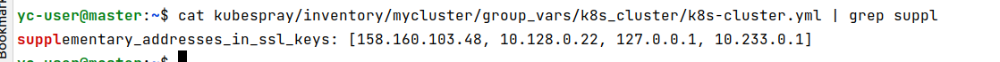
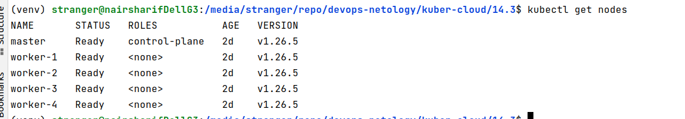

Прежде всего необходимо открыть доступ к кластеру не только локально с master, но и удаленно, чтобы было удобно редактировать и применять манифесты. Для этого в yandex cloud делаем ip хоста master статическим, чтобы он не менялся при перезагрузках. Затем редактируем файл:



После чего перезапускаем ansible установку, чтобы кластер перегенерировался с правильными сертификатами с нужными ip, доступными для подключение. Вообще, это надо было сделать в предыдущем задании, но раз я пропустил этот шаг, то придется повторить. Ansible пропустит уже выполненные шаги и переделает то, что нужно.

После чего спокойно подключаемся к кластеру удаленно:



```shell
(venv) stranger@nairsharifDellG3:/media/stranger/repo/devops-netology/kuber-cloud/14.3$ kubectl create namespace app
namespace/app created
(venv) stranger@nairsharifDellG3:/media/stranger/repo/devops-netology/kuber-cloud/14.3$ kubectl apply -f frontend.yaml 
deployment.apps/frontend created
service/frontend created
(venv) stranger@nairsharifDellG3:/media/stranger/repo/devops-netology/kuber-cloud/14.3$ kubectl apply -f backend.yaml 
deployment.apps/backend created
service/backend created
(venv) stranger@nairsharifDellG3:/media/stranger/repo/devops-netology/kuber-cloud/14.3$ kubectl apply -f cache.yaml 
deployment.apps/cache created
service/cache created
(venv) stranger@nairsharifDellG3:/media/stranger/repo/devops-netology/kuber-cloud/14.3$ kubectl apply -f policies.yaml 
networkpolicy.networking.k8s.io/frontend created
networkpolicy.networking.k8s.io/backend created
networkpolicy.networking.k8s.io/cache created
(venv) stranger@nairsharifDellG3:/media/stranger/repo/devops-netology/kuber-cloud/14.3$ kubectl get pods -n app
NAME                        READY   STATUS    RESTARTS   AGE
backend-7f6ffd4fb4-79hwb    1/1     Running   0          81s
cache-7bb8f4764b-bwtmj      1/1     Running   0          75s
frontend-85f54fff68-xzmvk   1/1     Running   0          88s
```
Проверяем валидные доступы:
```shell
(venv) stranger@nairsharifDellG3:/media/stranger/repo/devops-netology/kuber-cloud/14.3$ kubectl -n app exec frontend-85f54fff68-xzmvk -- curl backend
  % Total    % Received % Xferd  Average Speed   Time    Time     Time  Current
                                 Dload  Upload   Total   Spent    Left  Speed
100    81  100    81    0     0    262      0 --:--:-- --:--:-- --:--:--   262
Praqma Network MultiTool (with NGINX) - backend-7f6ffd4fb4-79hwb - 10.233.125.65
(venv) stranger@nairsharifDellG3:/media/stranger/repo/devops-netology/kuber-cloud/14.3$ kubectl -n app exec backend-7f6ffd4fb4-79hwb -- curl cache
  % Total    % Received % Xferd  Average Speed   Time    Time     Time  Current
                                 Dload  Upload   Total   Spent    Left  Speed
100    79  100    79    0     0   6337      0 --:--:-- --:--:-- --:--:--  6583
Praqma Network MultiTool (with NGINX) - cache-7bb8f4764b-bwtmj - 10.233.72.195
```
Проверяем невалидные доступы:
```shell
(venv) stranger@nairsharifDellG3:/media/stranger/repo/devops-netology/kuber-cloud/14.3$ kubectl -n app exec frontend-85f54fff68-xzmvk -- curl cache
  % Total    % Received % Xferd  Average Speed   Time    Time     Time  Current
                                 Dload  Upload   Total   Spent    Left  Speed
  0     0    0     0    0     0      0      0 --:--:--  0:00:04 --:--:--     0^C
(venv) stranger@nairsharifDellG3:/media/stranger/repo/devops-netology/kuber-cloud/14.3$ kubectl -n app exec backend-7f6ffd4fb4-79hwb -- curl frontend
  % Total    % Received % Xferd  Average Speed   Time    Time     Time  Current
                                 Dload  Upload   Total   Spent    Left  Speed
  0     0    0     0    0     0      0      0 --:--:--  0:00:02 --:--:--     0^C
(venv) stranger@nairsharifDellG3:/media/stranger/repo/devops-netology/kuber-cloud/14.3$ kubectl -n app exec cache-7bb8f4764b-bwtmj -- curl frontend
  % Total    % Received % Xferd  Average Speed   Time    Time     Time  Current
                                 Dload  Upload   Total   Spent    Left  Speed
  0     0    0     0    0     0      0      0 --:--:--  0:00:02 --:--:--     0^C
(venv) stranger@nairsharifDellG3:/media/stranger/repo/devops-netology/kuber-cloud/14.3$ kubectl -n app exec cache-7bb8f4764b-bwtmj -- curl backend
  % Total    % Received % Xferd  Average Speed   Time    Time     Time  Current
                                 Dload  Upload   Total   Spent    Left  Speed
  0     0    0     0    0     0      0      0 --:--:--  0:00:02 --:--:--     0^C
```

Все ОК, сетевые политики работают корректно.