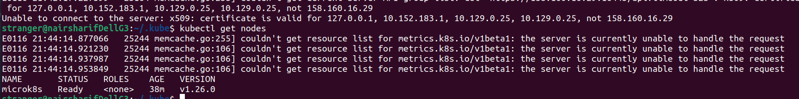
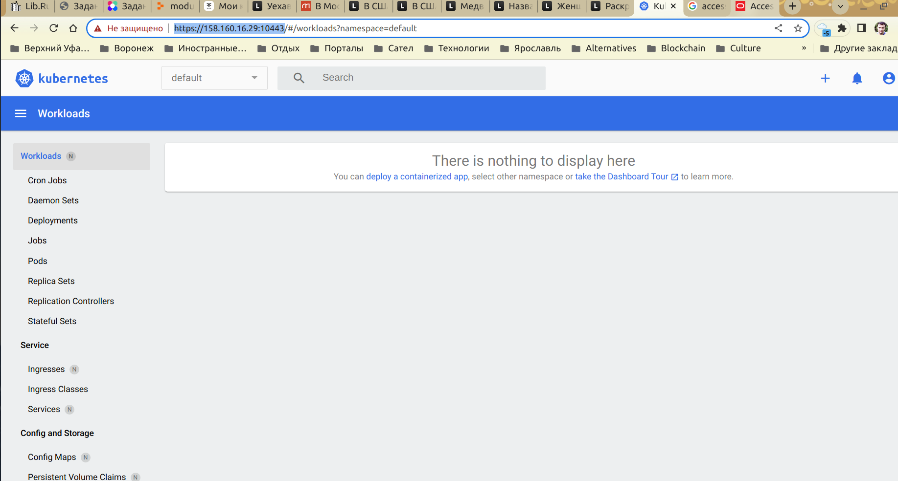

1) произведена установка microk8s по инструкции
2) командой microk8s.config получил вывод конфига кластера и скопировал его в локальную директорию .kube/config (у меня ubuntu)
3) подменил адрес в конфиге на адрес моего сервера (установлен в Яндекс облаке)
4) попытался подключиться и получил ошибку

откуда взялся еще один адрес, которого я не нашел на сервере-хосте для microk8s командой ip addr, мне не понятно, но я воспользовался решением отсюда
   https://stackoverflow.com/questions/63451290/microk8s-devops-unable-to-connect-to-the-server-x509-certificate-is-valid-f
   (первый вариант - добавил этот адрес в конфиг на сервере) и еще раз перегенерировал сертификат дашборда, чтобы учесть изменения
5) после чего подключение прошло успешно

   (верхние строчки означают только то, что я не настроил addon metrics-server, хотя он у меня установлен )
6) затем я настроил дашборд двумя способами port-forward, с учетом реального адреса виртуальной машины, и с широковещательным адресом, работает успешно в обоих случаях

вывод дашборда в браузере такой получился

вообще, должна быть админка дашборда без каких-либо данных о кластере (поскольку ни одной ноды у меня еще нет), но пока я получил только такой ответ, вероятно, дашборд требует какой-то дополнительной настройки microk8s
