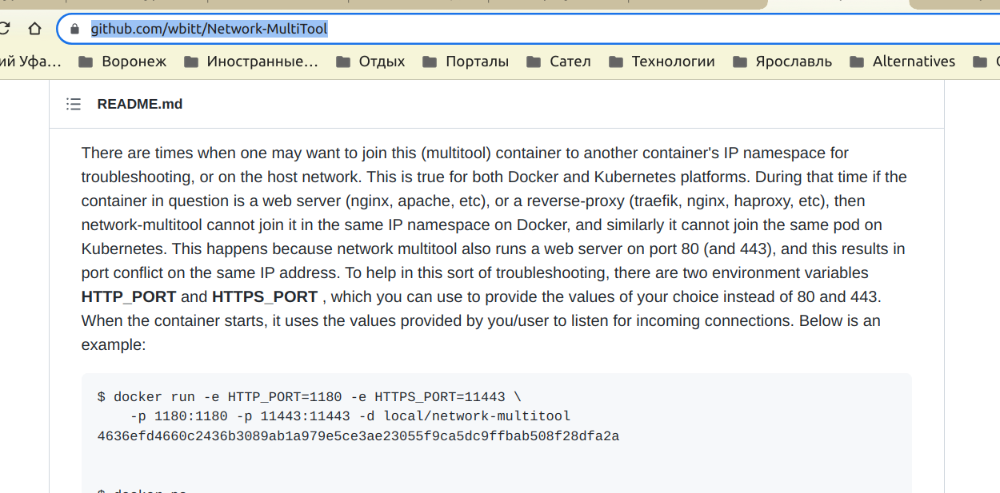
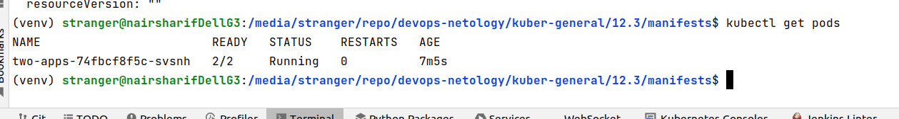
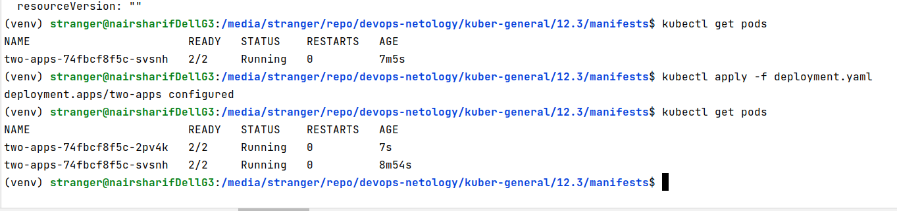
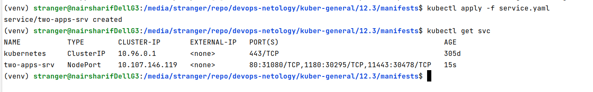
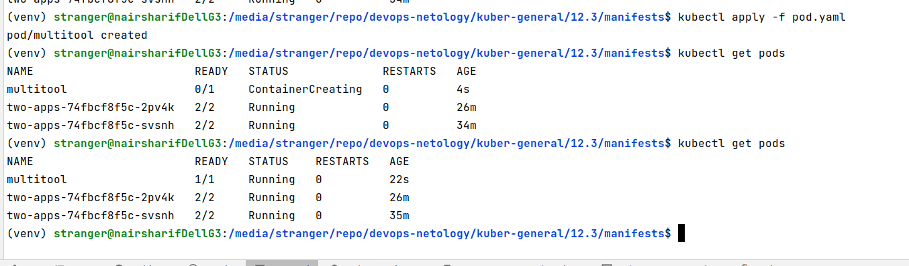
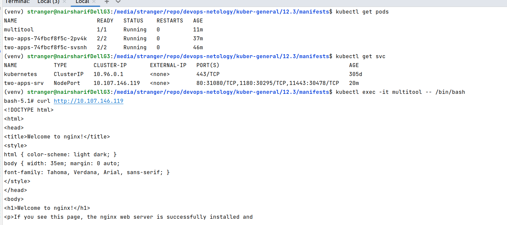
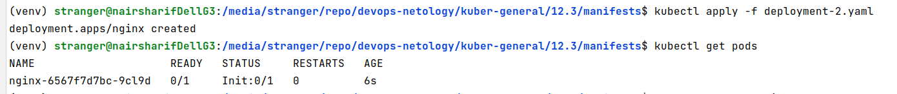
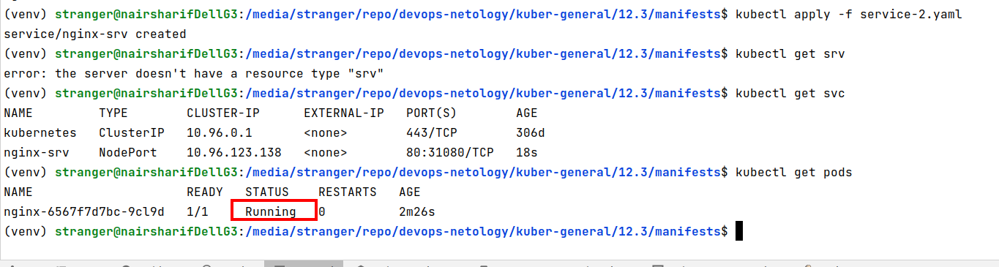

### Задание 1. Создать Deployment и обеспечить доступ к репликам приложения из другого Pod'а

1. Создать Deployment приложения состоящего из двух контейнеров - nginx и multitool. Решить возникшую ошибку

Ошибка возникает из конфликта портов и подробно описана [здесь](https://github.com/wbitt/Network-MultiTool)

Решается перенастройкой портов контейнера multitool на нестандартные порты в [deployment.yaml](manifests/deployment.yaml). В результате получим успешный запуск:

2. После запуска увеличить кол-во реплик работающего приложения до 2
3. Продемонстрировать кол-во подов до и после масштабирования

4. Создать Service, который обеспечит доступ до реплик приложений из п.1

[Сервис](manifests/service.yaml) успешно запускается

5. Создать отдельный Pod с приложением multitool и убедиться с помощью `curl` что из пода есть доступ до приложений из п.1

Создаем и запускаем [pod](manifests/pod.yaml)

Проверяем доступ

------

### Задание 2. Создать Deployment и обеспечить старт основного контейнера при выполнении условий

1. Создать Deployment приложения nginx и обеспечить старт контейнера только после того, как будет запущен сервис этого приложения

Остановим все предыдущие объекты kubernetes предварительно, чтобы они не мешали работать

Запустим новый [deployment](manifests/deployment-2.yaml)

2. Убедиться, что nginx не стартует. В качестве init-контейнера взять busybox

3. Создать и запустить Service. Убедиться, что nginx запустился

4. Продемонстрировать состояние пода до и после запуска сервиса

