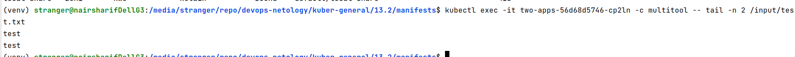
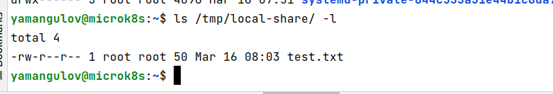
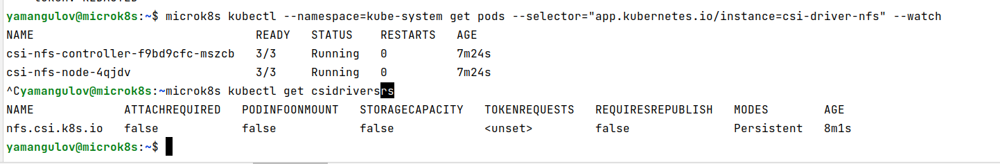
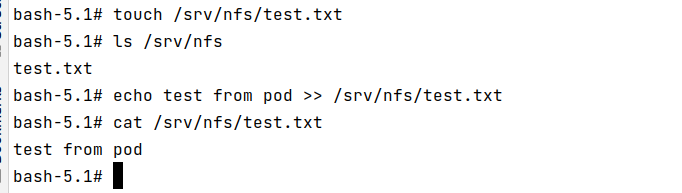
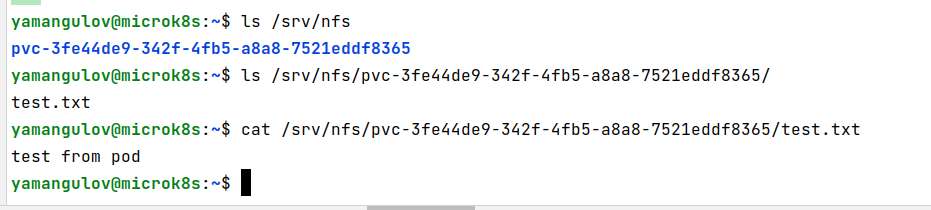

### Задание 1

**Что нужно сделать**

Создать Deployment приложения, использующего локальный PV, созданный вручную.

1. Создать Deployment приложения, состоящего из контейнеров busybox и multitool.
2. Создать PV и PVC для подключения папки на локальной ноде, которая будет использована в поде.
3. Продемонстрировать, что multitool может читать файл, в который busybox пишет каждые пять секунд в общей директории.
4. Продемонстрировать, что файл сохранился на локальном диске ноды, а также что произойдёт с файлом после удаления пода и deployment. Пояснить, почему.
5. Предоставить манифесты, а также скриншоты или вывод необходимых команд.

Файл [deployment](manifests/deployment.yaml)

Результаты:

Примечание:

данная конфигурация хранения будет хорошо работать в ванильном kubernetes или в microk8s (как у меня в облаке), но если вы будете пробовать ее в minikube, то она тоже будет работать вообще-то, но при этом локальное хранилище для minikube имеет ограничения, локальные каталоги ОС не доступны для него по умолчанию, и их нужно отдельно ручками примониторовать. Если этого не сделать, вы просто не увидите, что данные сохранились локально, на самом хосте ОС. По умолчанию, локальными считаются каталоги специально создаваемой VM minikube. Как это сделать, описано здесь:

https://stackoverflow.com/questions/63559779/kubernetes-minikube-persistent-volume-local-filesystem-storage-location

После удаления пода он просто пересоздался, файл сохранился локально, так как я поставил политку Retain. По этой же самой причине файл сохранился и после удаления всего деплоймента целиком, вместе с объектами pvc, pv. Если я ставлю политику Delete, то при удалении одного пода вручную файл также сохраняется, и также он сохраняется и при удалении деплоймента целиком. Причина очевидна - опция Delete для политики хранения распространяется на облачные реализации kubernetes, которые поддерживают сами облачные провайдеры. У меня же, хотя формально я установил microk8s в VM, поднятой в облаке, но это все равно для этой VM ЛОКАЛЬНАЯ установка кубера, не через специальный сервис, то есть облачная реализация кубера не используется. Если бы я использовал именно облачную реализацию кластера, он "под капотом" подчистил бы расшаренные файлы, смысл этого очевиден - облако не должно забиваться случайно забытыми и не удаленными пользователями шарами.

------

### Задание 2

**Что нужно сделать**

Создать Deployment приложения, которое может хранить файлы на NFS с динамическим созданием PV.

1. Включить и настроить NFS-сервер на MicroK8S.
2. Создать Deployment приложения состоящего из multitool, и подключить к нему PV, созданный автоматически на сервере NFS.
3. Продемонстрировать возможность чтения и записи файла изнутри пода.
4. Предоставить манифесты, а также скриншоты или вывод необходимых команд.

NFS сервер настроен

Пишем из пода в NFS

Читаем из NFS напрямую на сервере

В обратную сторону запись-чтение тоже работает. Обратим внимание, что в каталоге NFS создан отдельный подкаталог для pv, который создал нам динамически StorageClass, и уже в нем сохраняются шары. К этому же NFS каталогу вполне можно подключить и другие шары из других деплойментов.