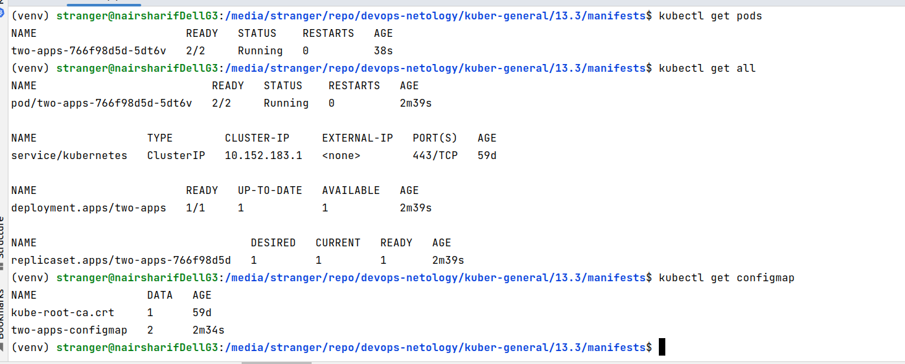
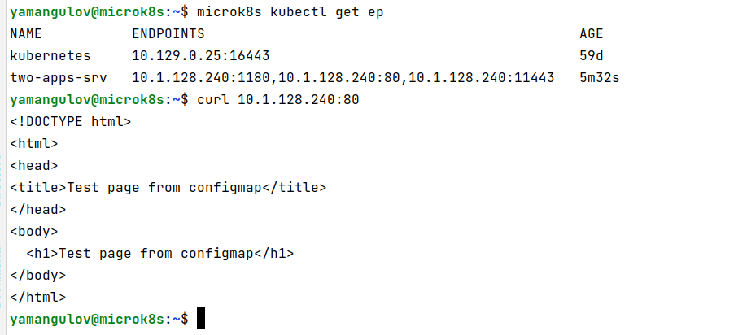
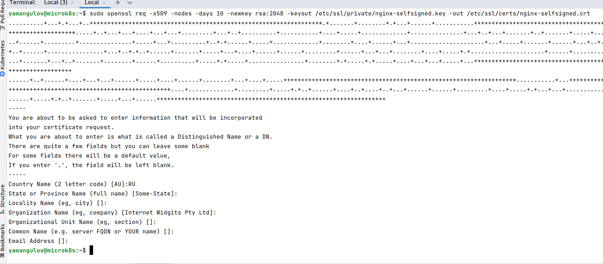
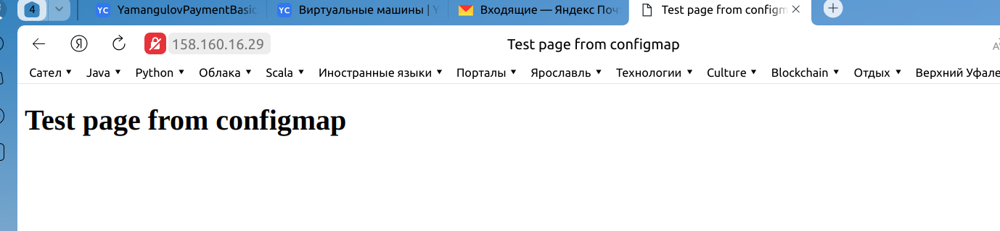

### Задание 1. Создать Deployment приложения и решить возникшую проблему с помощью ConfigMap. Добавить web-страницу

1. Создать Deployment приложения, состоящего из контейнеров ~~busybox~~ nginx и multitool.
2. Решить возникшую проблему с помощью ConfigMap
3. Продемонстрировать, что pod стартовал, и оба конейнера работают.
4. Сделать простую web-страницу и подключить ее к Nginx с помощью ConfigMap. Подключить Service и показать вывод curl или в браузере.
5. Предоставить манифесты, а также скриншоты и/или вывод необходимых команд.

В исходном тексте случайная опечатка, конфликт существует для nginx и multitool, а не busybox и multool, см. [ДЗ 12.3](../12.3/README.md), где это отражено правильно. Далее из п.4 задания понятно, что нужен именно nginx

Файлы для п.2 [deployment](manifests/deployment.yaml), [configmap](manifests/configmap.yaml)

Результаты

Файлы для п.4 [deployment](manifests/deployment-2.yaml), [configmap](manifests/configmap-2.yaml), [service](manifests/service.yaml)

Результат (в консоли vm на YandexCloud, так как ingress в задаче пока не задан)

------

### Задание 2. Создать приложение с вашей web-страницей, доступной по HTTPS

1. Создать Deployment приложения состоящего из nginx.
2. Создать собственную web-страницу и подключить ее как ConfigMap к приложению.
3. Выпустить самоподписной сертификат SSL. Создать Secret для использования данного сертификата.
4. Создать Ingress и необходимый Service, подключить к нему SSL в вид. Продемонстировать доступ к приложению по HTTPS.
4. Предоставить манифесты, а также скриншоты и/или вывод необходимых команд.

Файлы задания [deployment-3](manifests/deployment-3.yaml), [configmap-2](manifests/configmap-2.yaml), [configmap-3](manifests/configmap-3.yaml), [service-3](manifests/service-3.yaml), [ingress](manifests/ingress.yaml), [secret](manifests/secret.yaml)

Генерируем сертификат

Результат:

