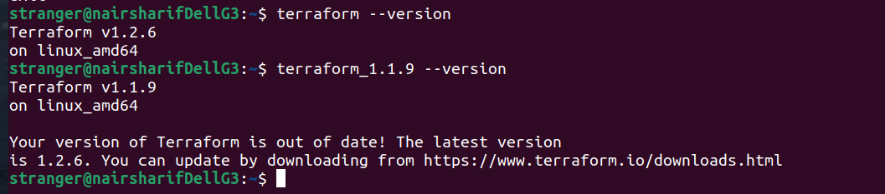

### Задача 1

#### Ответы на вопросы:

1. Какой тип инфраструктуры будем использовать для этого проекта: изменяемый или не изменяемый?

Инфраструктуру лучше будет, я думаю, разделить на четыре домена - dev, test, release и prod. В dev и test однозначно будем использовать изменяемую, в release и prod - неизменяемую

1. Будет ли центральный сервер для управления инфраструктурой?

Сами используемые технологии не требуют обязательного использования центральных серверов и по дефолту их не имеют, хотя какие-то legacy и можно настроить для этого, но это нерациональный, и на мой взгляд, устаревший подход. Однако, некоторая централизация управления все равно нужна, для этого рационально будет использовать какое-то промежуточное звено, например, gitlab ci/cd (следующий шаг после Teamcity, насколько я понимаю) и возможен какой-то централизованный интерфейс для управления разными кластерами kubernetes. Необходимо задать доп. вопросы - что есть, что нужно и что приемлемо для фирмы из этого

1. Будут ли агенты на серверах?

Агенты не требуются

1. Будут ли использованы средства для управления конфигурацией или инициализации ресурсов? 

Да, логично использовать и те, и другие средства. Так как это уже частично используется, рекомендовал бы использовать ansible + terraform, с packer и docker их вполне можно сочетать

Какие инструменты из уже используемых вы хотели бы использовать для нового проекта? 

С учетом изложенного вполне можно использовать практически все используемые ресурсы, грамотно выстроив процесс ci/cd так, чтобы он стал универсальным для всех разработчиков. Однако, хотелось бы по возможности отказаться от использования bash скриптов, так как они плохо поддерживаются и наверняка плохо документированы - за исключением тех скриптов, которые, может быть, интегрированы в Teamcity или могут быть интегрированы в gitlab ci/cd

Хотите ли рассмотреть возможность внедрения новых инструментов для этого проекта? 

gitlab ci/cd или что-то аналогичное

### Задача 2

Уже был у меня установлен при прохождении блока "Виртуализация" (см. скриншот ниже)

### Задача 3

Установил дополнительно более старую версию:

(Мой метод установки - получение готовой сборки из облака Яндекса https://cloud.yandex.ru/docs/tutorials/infrastructure-management/terraform-quickstart, затем - просто распаковать и перенести бинарник в /usr/bin, у меня ubuntu linux, тогда сразу бинарники видны, не нужно подправлять path, и всегда можно поставить сколько угодно версий, соответственно переименовав бинарники)

