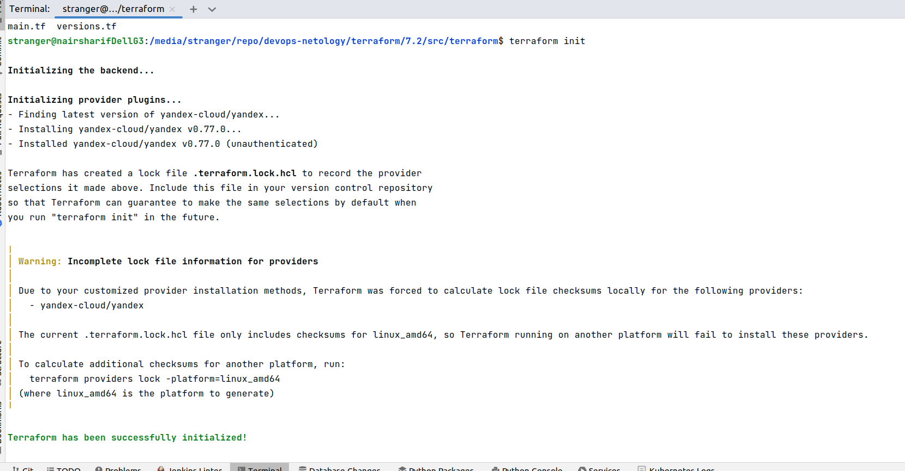
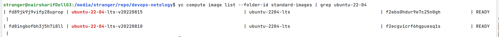
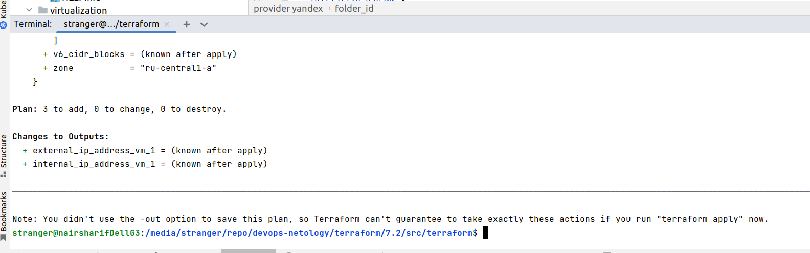

# Домашнее задание к занятию "7.2. Облачные провайдеры и синтаксис Terraform."

## Задача 1 (Вариант с Yandex.Cloud). Регистрация в ЯО и знакомство с основами (необязательно, но крайне желательно).

1. Подробная инструкция на русском языке содержится [здесь](https://cloud.yandex.ru/docs/solutions/infrastructure-management/terraform-quickstart).
2. Обратите внимание на период бесплатного использования после регистрации аккаунта. 
3. Используйте раздел "Подготовьте облако к работе" для регистрации аккаунта. Далее раздел "Настройте провайдер" для подготовки
базового терраформ конфига.
4. Воспользуйтесь [инструкцией](https://registry.terraform.io/providers/yandex-cloud/yandex/latest/docs) на сайте терраформа, что бы 
не указывать авторизационный токен в коде, а терраформ провайдер брал его из переменных окружений.

Выполнено: terraform уже был у меня установлен в рамках занятий 5.3 и 5.4. Однако, переменные хранились в некотором файле, поэтому я перенес их для этого задания в переменные среды. Соответственно, в файле [main.tf](src/terraform/main.tf) token, cloud_id и folder_id пустые, они будут получены из переменных среды YC_TOKEN, YC_CLOUD_ID, YC_FOLDER_ID

## Задача 2. Создание yandex_compute_instance через терраформ. 

1. В каталоге `terraform` вашего основного репозитория, который был создан в начале курсе, создайте файл `main.tf` и `versions.tf`.

Выполнено

2. Зарегистрируйте провайдер 
   1. для [yandex.cloud](https://registry.terraform.io/providers/yandex-cloud/yandex/latest/docs). Подробную инструкцию можно найти 
   [здесь](https://cloud.yandex.ru/docs/solutions/infrastructure-management/terraform-quickstart) 

   
   В файл `main.tf` добавьте
   блок `provider`, а в `versions.tf` блок `terraform` с вложенным блоком `required_providers`. Укажите любой выбранный вами регион внутри блока `provider`.

Выполнено:

   
3. Внимание! В гит репозиторий нельзя пушить ваши личные ключи доступа к аккаунту. Поэтому в предыдущем задании мы указывали их в виде переменных окружения. 

Выполнено ранее

4. В файле `main.tf` воспользуйтесь блоком `data "aws_ami` для поиска ami образа последнего Ubuntu.  

При работе с Yandex Cloud ищем аналогичные подходящие образы такой командой:

5. В файле `main.tf` создайте ресурс 
   1. [yandex_compute_image](https://registry.terraform.io/providers/yandex-cloud/yandex/latest/docs/resources/compute_image).
    
6. Добейтесь того, что бы команда `terraform plan` выполнялась без ошибок. 

Выполнено:

В качестве результата задания предоставьте:
1. Ответ на вопрос: при помощи какого инструмента (из разобранных на прошлом занятии) можно создать свой образ ami?

Как в AWS образ ami, так и в Yandex Cloud образы можно использовать с помощью инструмента resource, в котором мы указываем индентификатор стандартного образа либо собственного кастомного образа. Для aws можно воспользоваться AWS CloudFormation, для Yandex Cloud вполне можно собрать собственный образ при помощи Ansible

2. Ссылку на репозиторий с исходной конфигурацией терраформа. 
 

