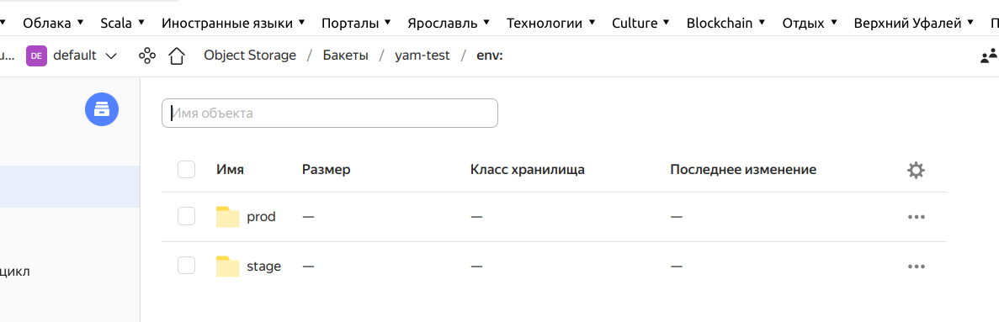

#### Задание 1

Несмотря на то, что в документации Яндекс описывается создание и настройка бакета S3 в Object Storage, но первоначально задокументированный метод показался мне неработоспособеным, так как файлы состояний не появились. Но затем, после запуска terraform apply все заработало. Следоватльно - для Яндекс также, как для aws вполне можно хранить состояния в облаке.

Кроме того, параметры access_key и secret_key также не удается завести никаким способом через переменные среды в секции backend - это просто ЗАПРЕЩЕНО, пробовал через переменные среды, через локальные переменные, файл профиля, как угодно - запрещено и все. Поэтому для тестирования пришлось завести ключи в явном виде, а перед пушем коммита в github удалить ключи снова.

#### Задание 2

А вот здесь все прекрасно работает.


Вывод terraform apply для prod:

```shell
stranger@nairsharifDellG3:/media/stranger/repo/devops-netology/terraform/7.3/src/terraform$ terraform apply

Terraform used the selected providers to generate the following execution plan. Resource actions are indicated with the following symbols:
  + create

Terraform will perform the following actions:

  # yandex_storage_bucket.bucket-per-count[0] will be created
  + resource "yandex_storage_bucket" "bucket-per-count" {
      + access_key            = "YCAJEOyB9tf_BSkxC-XobQvyf"
      + acl                   = "private"
      + bucket                = "yam-test-0-prod"
      + bucket_domain_name    = (known after apply)
      + default_storage_class = (known after apply)
      + folder_id             = (known after apply)
      + force_destroy         = false
      + id                    = (known after apply)
      + secret_key            = (sensitive value)
      + website_domain        = (known after apply)
      + website_endpoint      = (known after apply)

      + anonymous_access_flags {
          + list = (known after apply)
          + read = (known after apply)
        }

      + versioning {
          + enabled = (known after apply)
        }
    }

  # yandex_storage_bucket.bucket-per-count[1] will be created
  + resource "yandex_storage_bucket" "bucket-per-count" {
      + access_key            = "YCAJEOyB9tf_BSkxC-XobQvyf"
      + acl                   = "private"
      + bucket                = "yam-test-1-prod"
      + bucket_domain_name    = (known after apply)
      + default_storage_class = (known after apply)
      + folder_id             = (known after apply)
      + force_destroy         = false
      + id                    = (known after apply)
      + secret_key            = (sensitive value)
      + website_domain        = (known after apply)
      + website_endpoint      = (known after apply)

      + anonymous_access_flags {
          + list = (known after apply)
          + read = (known after apply)
        }

      + versioning {
          + enabled = (known after apply)
        }
    }

  # yandex_storage_bucket.bucket-per-foreach["bucket1"] will be created
  + resource "yandex_storage_bucket" "bucket-per-foreach" {
      + access_key            = "YCAJEOyB9tf_BSkxC-XobQvyf"
      + acl                   = "private"
      + bucket                = "yam-test-bucket1-prod"
      + bucket_domain_name    = (known after apply)
      + default_storage_class = (known after apply)
      + folder_id             = (known after apply)
      + force_destroy         = false
      + id                    = (known after apply)
      + secret_key            = (sensitive value)
      + website_domain        = (known after apply)
      + website_endpoint      = (known after apply)

      + anonymous_access_flags {
          + list = (known after apply)
          + read = (known after apply)
        }

      + versioning {
          + enabled = (known after apply)
        }
    }

  # yandex_storage_bucket.bucket-per-foreach["bucket2"] will be created
  + resource "yandex_storage_bucket" "bucket-per-foreach" {
      + access_key            = "YCAJEOyB9tf_BSkxC-XobQvyf"
      + acl                   = "private"
      + bucket                = "yam-test-bucket2-prod"
      + bucket_domain_name    = (known after apply)
      + default_storage_class = (known after apply)
      + folder_id             = (known after apply)
      + force_destroy         = false
      + id                    = (known after apply)
      + secret_key            = (sensitive value)
      + website_domain        = (known after apply)
      + website_endpoint      = (known after apply)

      + anonymous_access_flags {
          + list = (known after apply)
          + read = (known after apply)
        }

      + versioning {
          + enabled = (known after apply)
        }
    }

Plan: 4 to add, 0 to change, 0 to destroy.

Do you want to perform these actions in workspace "prod"?
  Terraform will perform the actions described above.
  Only 'yes' will be accepted to approve.

  Enter a value: yes

yandex_storage_bucket.bucket-per-count[1]: Creating...
yandex_storage_bucket.bucket-per-foreach["bucket1"]: Creating...
yandex_storage_bucket.bucket-per-count[0]: Creating...
yandex_storage_bucket.bucket-per-foreach["bucket2"]: Creating...
yandex_storage_bucket.bucket-per-foreach["bucket1"]: Still creating... [10s elapsed]
yandex_storage_bucket.bucket-per-foreach["bucket2"]: Still creating... [10s elapsed]
yandex_storage_bucket.bucket-per-count[1]: Still creating... [10s elapsed]
yandex_storage_bucket.bucket-per-count[0]: Still creating... [10s elapsed]
yandex_storage_bucket.bucket-per-count[0]: Still creating... [20s elapsed]
yandex_storage_bucket.bucket-per-foreach["bucket1"]: Still creating... [20s elapsed]
yandex_storage_bucket.bucket-per-foreach["bucket2"]: Still creating... [20s elapsed]
yandex_storage_bucket.bucket-per-count[1]: Still creating... [20s elapsed]
yandex_storage_bucket.bucket-per-foreach["bucket2"]: Still creating... [30s elapsed]
yandex_storage_bucket.bucket-per-count[1]: Still creating... [30s elapsed]
yandex_storage_bucket.bucket-per-foreach["bucket1"]: Still creating... [30s elapsed]
yandex_storage_bucket.bucket-per-count[0]: Still creating... [30s elapsed]
yandex_storage_bucket.bucket-per-foreach["bucket1"]: Still creating... [40s elapsed]
yandex_storage_bucket.bucket-per-count[1]: Still creating... [40s elapsed]
yandex_storage_bucket.bucket-per-count[0]: Still creating... [40s elapsed]
yandex_storage_bucket.bucket-per-foreach["bucket2"]: Still creating... [40s elapsed]
yandex_storage_bucket.bucket-per-foreach["bucket2"]: Still creating... [50s elapsed]
yandex_storage_bucket.bucket-per-foreach["bucket1"]: Still creating... [50s elapsed]
yandex_storage_bucket.bucket-per-count[0]: Still creating... [50s elapsed]
yandex_storage_bucket.bucket-per-count[1]: Still creating... [50s elapsed]
yandex_storage_bucket.bucket-per-count[0]: Still creating... [1m0s elapsed]
yandex_storage_bucket.bucket-per-foreach["bucket2"]: Still creating... [1m0s elapsed]
yandex_storage_bucket.bucket-per-foreach["bucket1"]: Still creating... [1m0s elapsed]
yandex_storage_bucket.bucket-per-count[1]: Still creating... [1m0s elapsed]
yandex_storage_bucket.bucket-per-foreach["bucket2"]: Creation complete after 1m1s [id=yam-test-bucket2-prod]
yandex_storage_bucket.bucket-per-count[0]: Creation complete after 1m1s [id=yam-test-0-prod]
yandex_storage_bucket.bucket-per-count[1]: Creation complete after 1m1s [id=yam-test-1-prod]
yandex_storage_bucket.bucket-per-foreach["bucket1"]: Creation complete after 1m1s [id=yam-test-bucket1-prod]

Apply complete! Resources: 4 added, 0 changed, 0 destroyed.

```
А вот как это выглядит в облаке в S3 Яндекса
