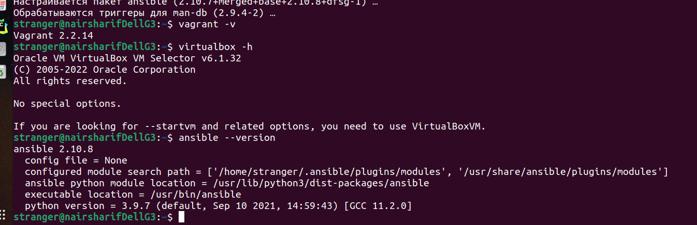
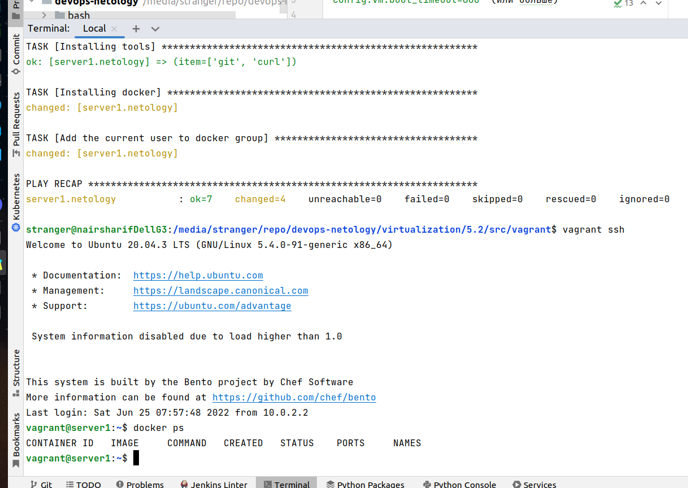

# Домашнее задание к занятию "5.2. Применение принципов IaaC в работе с виртуальными машинами"


---

## Задача 1

- Опишите своими словами основные преимущества применения на практике IaaC паттернов.

IaaC - это предоставление инфраструктуры, как кода. То есть это означает, что весь процесс создания, развертывания, модификации, предоставления и управления сред для разработки ПО кодируется, то есть сам по себе является неким ПО, и поэтому им можно управлять так же точно, как мы управляем ПО - путем модификации кода или предоставления настроечных параметров в код. Вследствие этого IaaC позволяет 1) ускорить процесс предоставления инфраструктуры для разработки, необходимые среды можно разработать заранее и настроить, а затем разворачивать из шаблонов, 2) устранить или минимизировать дрейф конфигураций - несовпадение параметров сред разработки, тестирования и развертывания, все разработчики знакомы с ситуацией, когда ПО нормально работает в среде разработки, а в продуктовой среде возникают проблемы, возможность быстро устранить рассогласование сред минимизирует эту проблему 3) автоматизировать CI/CD/CD - всю цепочку workflow при разработке - когда быстро предоставляются отдельные среды на всех стадиях разработки разработчикам, тестировщикам и так далее, и когда быстро автоматически выполняется передача очередной модификации ПО по всем этапам процесса, то весь workflow значительно ускоряется и ПО быстрее выходит в продуктив

- Какой из принципов IaaC является основополагающим?

Главный принцип - идемпотентность, то есть возможность получить один и тот же результат, выполнив одно и то же действие повторно и более раз. Это гарантирует предсказуемость действий в DevOps, если бы его не было, то любая автоматизация процессов вообще была бы невозможна, потому что невозможно добиться стабильного результата своих действий.


## Задача 2

- Чем Ansible выгодно отличается от других систем управление конфигурациями?

Ansible использует существующую инфраструктуру ssh ключей, отчего можно быстро развернуть его, не разворачивая отдельной PKI, конфигурация Ansible - декларативная - настройки легче изучить и выполнять, также Ansible легко расширяется с помощью подключения дополнительных ролей и модулей, а их написано очень много, можно подобрать на все случаи или написать свой модуль

- Какой, на ваш взгляд, метод работы систем конфигурации более надёжный push или pull?

Полагаю, что push метод более надежен, так как он не требует установки отдельных агентов на каждый клиент сервера конфигураций, что может оказаться очень трудоемким и увеличивает число не локализованных в одном месте точек отказа, кроме того, самое главное, как мне кажется - при отказе после обновления конфигурации push методом можно реализовать автоматический централизованный откат на предыдущую версию (на данный момент мне пока трудно представить себе, как бы это можно было сделать для pull метода), можно даже хранить несколько вариантов конфигураций в глубину по их истории

## Задача 3

Установить на личный компьютер:

- VirtualBox
- Vagrant
- Ansible




*Приложить вывод команд установленных версий каждой из программ, оформленный в markdown.*

## Задача 4 (*)

Воспроизвести практическую часть лекции самостоятельно.

- Создать виртуальную машину.
- Зайти внутрь ВМ, убедиться, что Docker установлен с помощью команды
```
docker ps
```

Выполнено (примечания в файле [ERRORS_POSSIBLE.md](ERRORS_POSSIBLE.md)):

