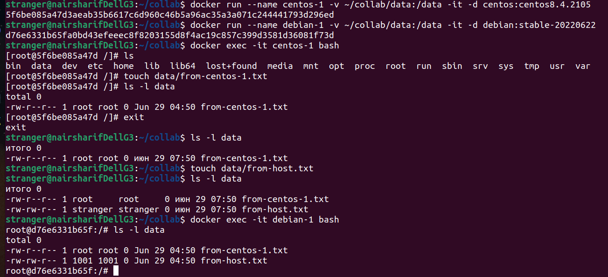

# Домашнее задание к занятию "5.3. Введение. Экосистема. Архитектура. Жизненный цикл Docker контейнера"

---

## Задача 1

Сценарий выполения задачи:

- создайте свой репозиторий на https://hub.docker.com;
- выберете любой образ, который содержит веб-сервер Nginx;
- создайте свой fork образа;
- реализуйте функциональность:
запуск веб-сервера в фоне с индекс-страницей, содержащей HTML-код ниже:
```
<html>
<head>
Hey, Netology
</head>
<body>
<h1>I’m DevOps Engineer!</h1>
</body>
</html>
```
Опубликуйте созданный форк в своем репозитории и предоставьте ответ в виде ссылки на https://hub.docker.com/username_repo.

Выполнено: https://hub.docker.com/repository/docker/yamangulov/nginx-test-1

## Задача 2

Посмотрите на сценарий ниже и ответьте на вопрос:
"Подходит ли в этом сценарии использование Docker контейнеров или лучше подойдет виртуальная машина, физическая машина? Может быть возможны разные варианты?"

Детально опишите и обоснуйте свой выбор.

--

Сценарий:

- Высоконагруженное монолитное java веб-приложение;

Вполне можно рассмотреть два варианта: 1) физический сервер, полностью отданный под данную высоконагруженную задачу и 2) нельзя исключать также использование docker контейнера при условии, что он расположен на сервере, где для управления контейнерами используется хорошая оркестрация с выделением достаточных ресурсов и правильной настройкой безопасности

- Nodejs веб-приложение;

Это обычное веб-приложение, вполне можно использовать docker контейнер

- Мобильное приложение c версиями для Android и iOS;

Вообще говоря, для разработки мобильного приложения нужна виртуалка, потому что требуется видеть и тестировать его GUI, это может быть виртуалка из Android Studio, например. Но в принципе, я встречал где-то статьи в Интернет, где прямо в docker контейнер ставили androidsdk, вероятно, это можно сделать, но я бы не стал - есть же удобный инструмент, зачем изобретать велосипед, разве что из спортивного интереса.

- Шина данных на базе Apache Kafka;

Опять же можно использовать и физический сервер, и виртуалку, и контейнер, смотря по обстоятельствам. Но при использовании контейнера необходимо специально позаботиться о том, чтобы данные сохранялись при его отключении (должно быть как-то реализовано stateful)

- Elasticsearch кластер для реализации логирования продуктивного веб-приложения - три ноды elasticsearch, два logstash и две ноды kibana;

Прекрасно работает в контейнерах, если выделено достаточно ресурсов, при условии сохранения состояния в подключаемых томах, на мощных серверах (я сам делал такие кейсы). В особых случаях можно, конечно, и выделенные серверы использовать, если фирма очень богатая. 

- Мониторинг-стек на базе Prometheus и Grafana;

То же самое, что и в предыдущем случае, мне самому доводилось поднимать связки с ними в docker-compose, не вижу препятствий особенных, кроме выделения достаточных ресурсов

- MongoDB, как основное хранилище данных для java-приложения;

Так же не вижу препятствий - mongo data вполне можно подключать как тома контейнера

- Gitlab сервер для реализации CI/CD процессов и приватный (закрытый) Docker Registry.

Вот здесь, мне кажется, лучше использовать выделенный сервер, так как такие серверы должны однозначно поддерживать очень большой объем хранимых данных. Но формально не вижу препятствий поднять сами серверы как контейнеры, а хранилища подключить как тома, это тоже возможно, лишь бы ресурсов хватило.

## Задача 3

- Запустите первый контейнер из образа ***centos*** c любым тэгом в фоновом режиме, подключив папку ```/data``` из текущей рабочей директории на хостовой машине в ```/data``` контейнера;
- Запустите второй контейнер из образа ***debian*** в фоновом режиме, подключив папку ```/data``` из текущей рабочей директории на хостовой машине в ```/data``` контейнера;
- Подключитесь к первому контейнеру с помощью ```docker exec``` и создайте текстовый файл любого содержания в ```/data```;
- Добавьте еще один файл в папку ```/data``` на хостовой машине;
- Подключитесь во второй контейнер и отобразите листинг и содержание файлов в ```/data``` контейнера.

Выполнено:


## Задача 4 (*)

Воспроизвести практическую часть лекции самостоятельно.

Соберите Docker образ с Ansible, загрузите на Docker Hub и пришлите ссылку вместе с остальными ответами к задачам.

Выполнено: https://hub.docker.com/r/yamangulov/ansible/tags

---
