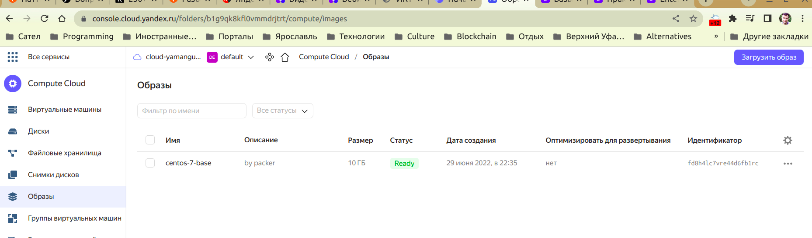
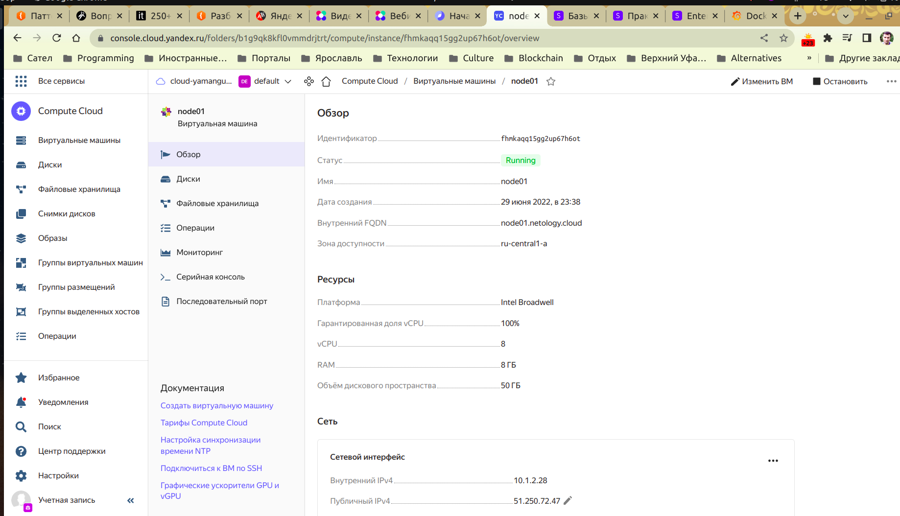
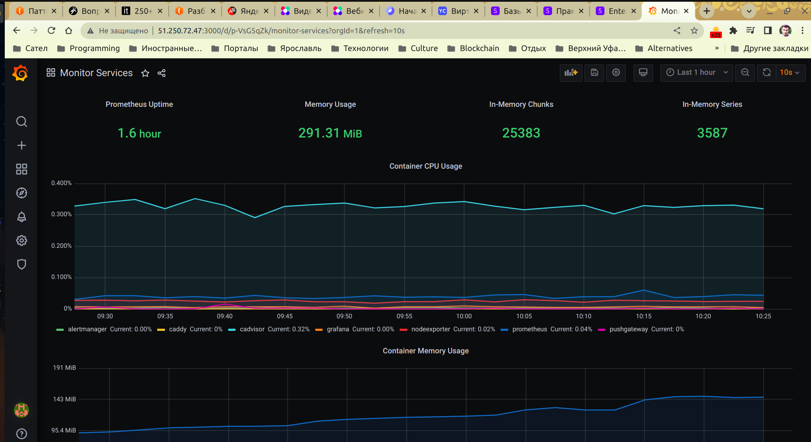
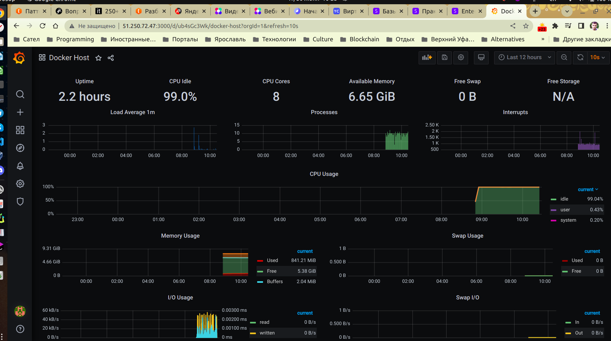
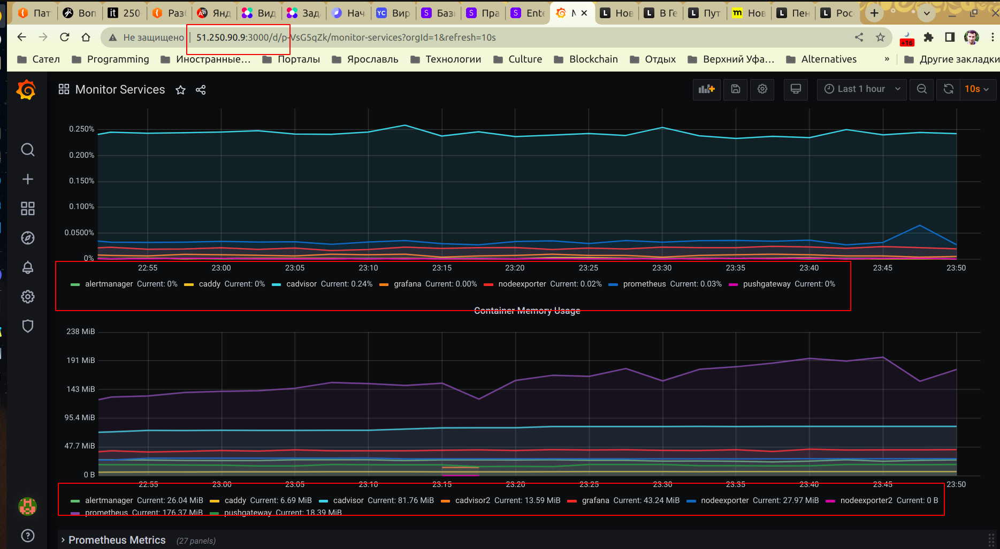

# Домашнее задание к занятию "5.4. Оркестрация группой Docker контейнеров на примере Docker Compose"

---

## Задача 1

Создать собственный образ операционной системы с помощью Packer.

Выполнено:

## Задача 2

Создать вашу первую виртуальную машину в Яндекс.Облаке.

Выполнено:

## Задача 3

Создать ваш первый готовый к боевой эксплуатации компонент мониторинга, состоящий из стека микросервисов.

Выполнено:

## Задача 4 (*)

Создать вторую ВМ и подключить её к мониторингу развёрнутому на первом сервере.

Выполнено, но результат неоднозначный и не совсем мне понятен. Метрика Container Memory Usage успешно отобразилась, но метрика Container CPU Usage не содержит дополнительных графиков для nodeexporter2 и cadvisor2. Я связываю это с тем, что вторая метрика рассчитывается на пользователя (первая - общая), возможно, это как-то связано, и если составить какую-то другую метрику для CPU Usage не на пользователя, а общую, то отобразятся все job_name и в ней тоже.
(Примечание: я не настраивал для этих виртуалок сохранение статического IP адреса в Yandex.Cloud, поэтому в строке адрес графаны уже другой, так как Яндекс меняет его каждый раз при команде terraform apply, которую я запускал несколько раз при отладке)

