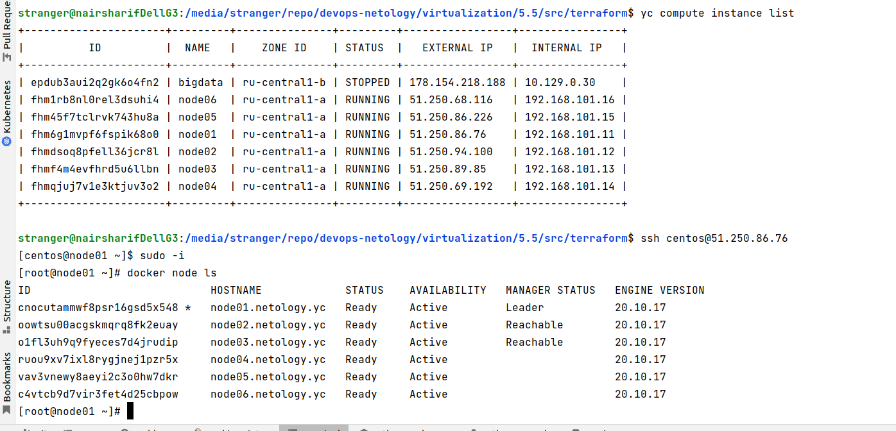
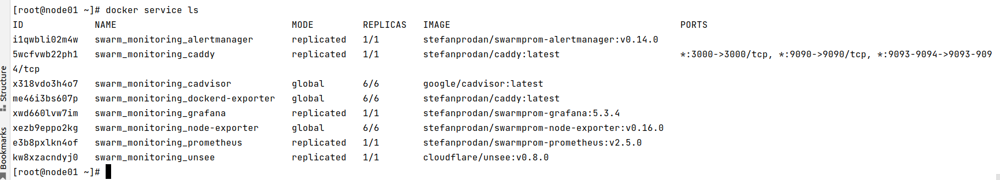
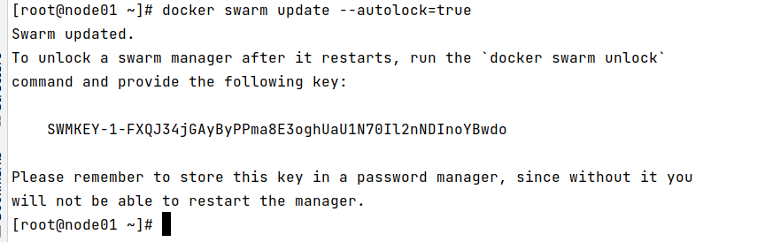

# Домашнее задание к занятию "5.5. Оркестрация кластером Docker контейнеров на примере Docker Swarm"

---

## Задача 1

Дайте письменые ответы на следующие вопросы:

- В чём отличие режимов работы сервисов в Docker Swarm кластере: replication и global?

В replication мы произвольно сами управляем кол-вом нод кластера, на которые должен реплицироваться нужный сервис, в global репликация заданного сервиса осуществляется автоматически на все доступные узлы кластера

- Какой алгоритм выбора лидера используется в Docker Swarm кластере?

Применяется алгоритм поддержания распределенного консенсуса - Raft, то есть в кластере есть несколько управляющих нод manager, одна из которых - лидер, если лидер перестает корректно работать, остальные manager ноды договариваются между собой по этому алгоритму и назначается новый лидер

- Что такое Overlay Network?

Это специальный вид docker сети - распределенная сеть, которая умеет связывать несколько docker демонов между собой и самостоятельно "под капотом" осуществляет маршрутизацию между демонами и сервисами, запущенными на разных демонах, настройка overlay сети позволяет не углубляться в кастомные настройки маршрутизации на конкретных хостах и при переносе групп контейнеров между разными физическими хостами, все это делается "под капотом" overlay networking автоматически

## Задача 2

Создать ваш первый Docker Swarm кластер в Яндекс.Облаке

Выполнено:

## Задача 3

Создать ваш первый, готовый к боевой эксплуатации кластер мониторинга, состоящий из стека микросервисов.

Выполнено:

## Задача 4 (*)

Выполнить на лидере Docker Swarm кластера команду (указанную ниже) и дать письменное описание её функционала, что она делает и зачем она нужна:

Выполнено:

Данная команда включает автоблокировку swarm менеджера в кластере после его перезагрузки, для обеспечения его дополнительной безопасности - чтобы нельзя было "вытащить" ключи шифрования из памяти узла, так как при рестарте узла ключи попадают в память. Дополнительный ключ для блокировки/разблокировки улучшает защиту, защищая сами ключи шифрования, этот дополнительный ключ нужно хранить в безопасном месте и использовать для разблокировки командой docker swarm unlock